1. параметры виртуальной машины в процессе создания (имя ВМ, память, диск)

2. командная строка Ubuntu после установки с приглашением фамилия@фамилия:~$
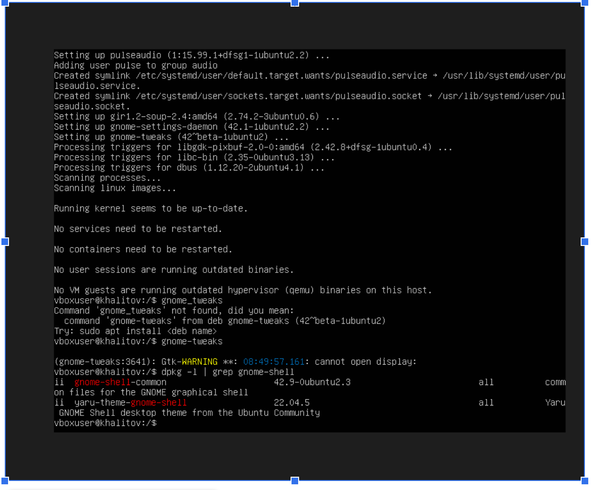

3. вывод cat ~/report/01-system.txt
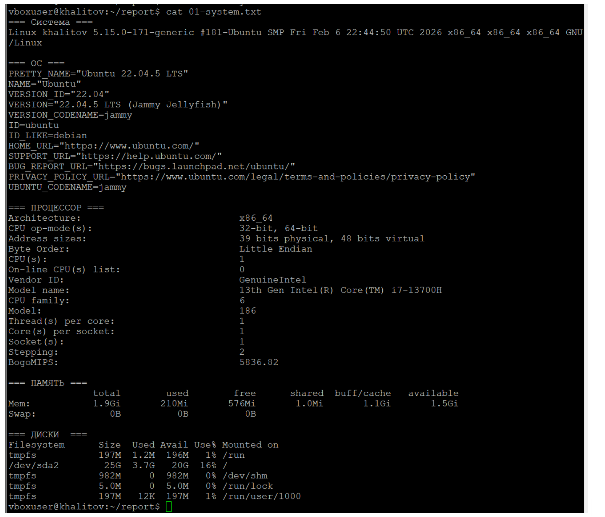

4. вывод ip addr show

5. вывод sudo ss -tlnp
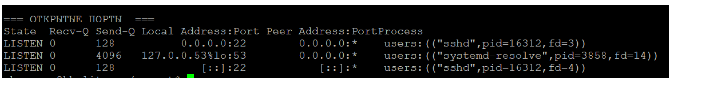

6. вывод sudo systemctl status ssh

7. вывод sudo ss -tlnp | grep ssh

8. вывод grep '/bin/bash' /etc/passwd
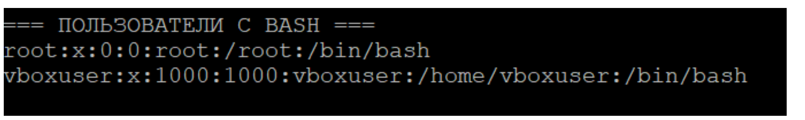

9. процесс создания пользователя boardy
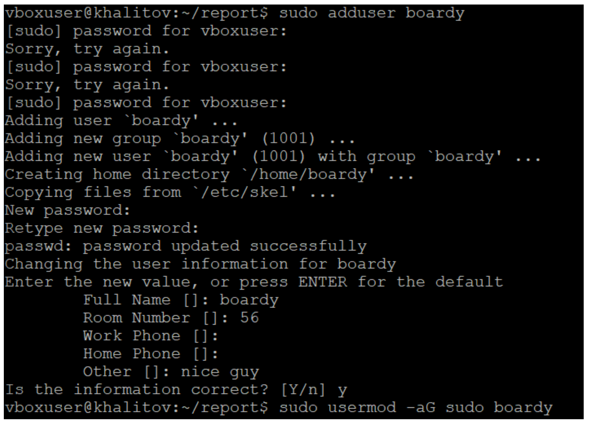

10. вывод id boardy
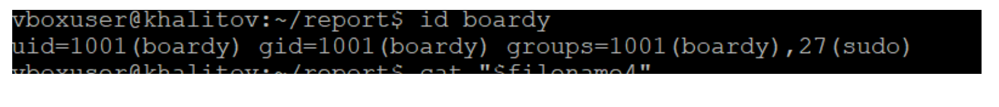

11. вывод ls -la /

12. вывод ls -la ~
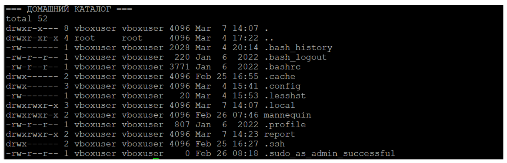

13. вывод ls -ld / /etc /var /tmp /home

14. три состояния testfile.txt (до, после chmod 755, после chmod 600)
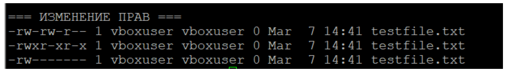

15. вывод dpkg -l | grep -E 'openssh|python|git|curl|vim|nano'
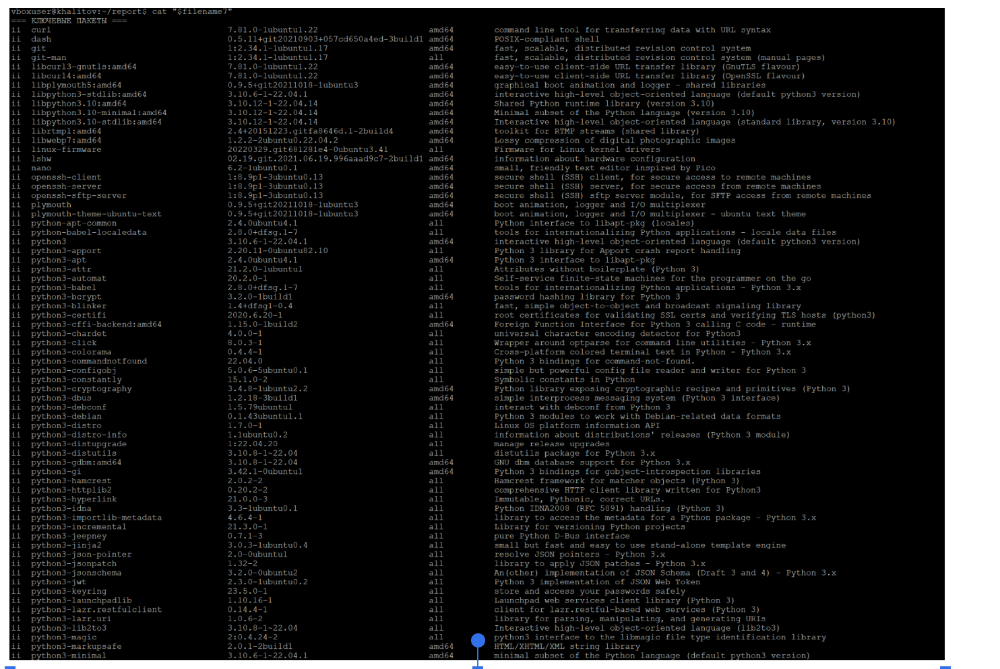

16. вывод systemctl list-units --type=service --state=running

17. вывод ps aux --sort=-%mem | head -11

18. вывод подсчёта процессов по пользователям

19. вывод топ-10 больших файлов в /var
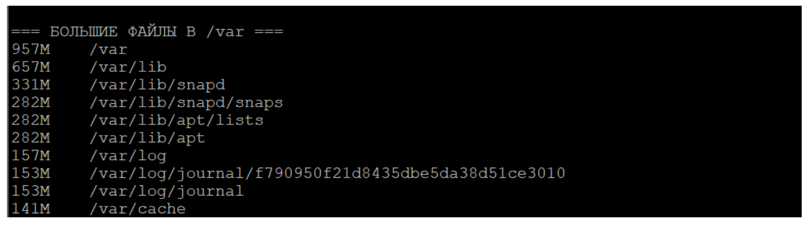

20. вывод ls -lh ~/report/ со всеми файлами
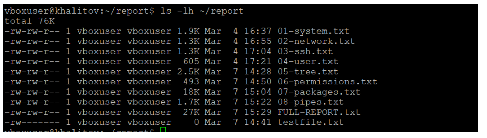

