# Отчет по лабораторной работе №10
**Тема:** Авторизация: куки и сессии

---

### Часть A. Подготовка и вёрстка

#### Задание 1. Столбец password_hash

  <strong>DESCRIBE users с новым столбцом</strong> 
  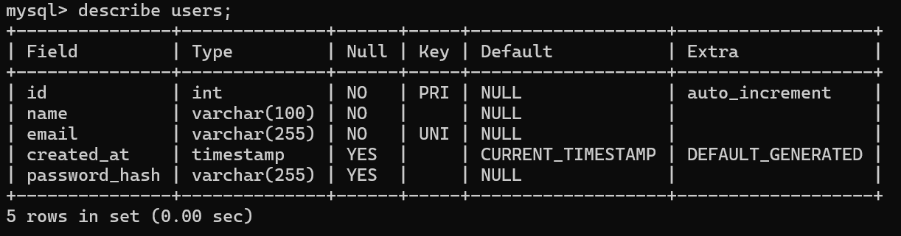

##### Почему VARCHAR(255), а не VARCHAR(60)?
Могут измениться стандарты хеширования, после чего скорее новые хеши не будут проходить валидацию по "<=60".

##### Что бы произошло если сделать VARCHAR(50)?
При bcrypt хеш просто бы не прошёл валидацию по кол-ву символов, и СУБД выдала бы ошибку.

---

#### Задание 2. Partials

  <strong>Шапка сайта в режиме гостя (по макету 1)</strong> 
  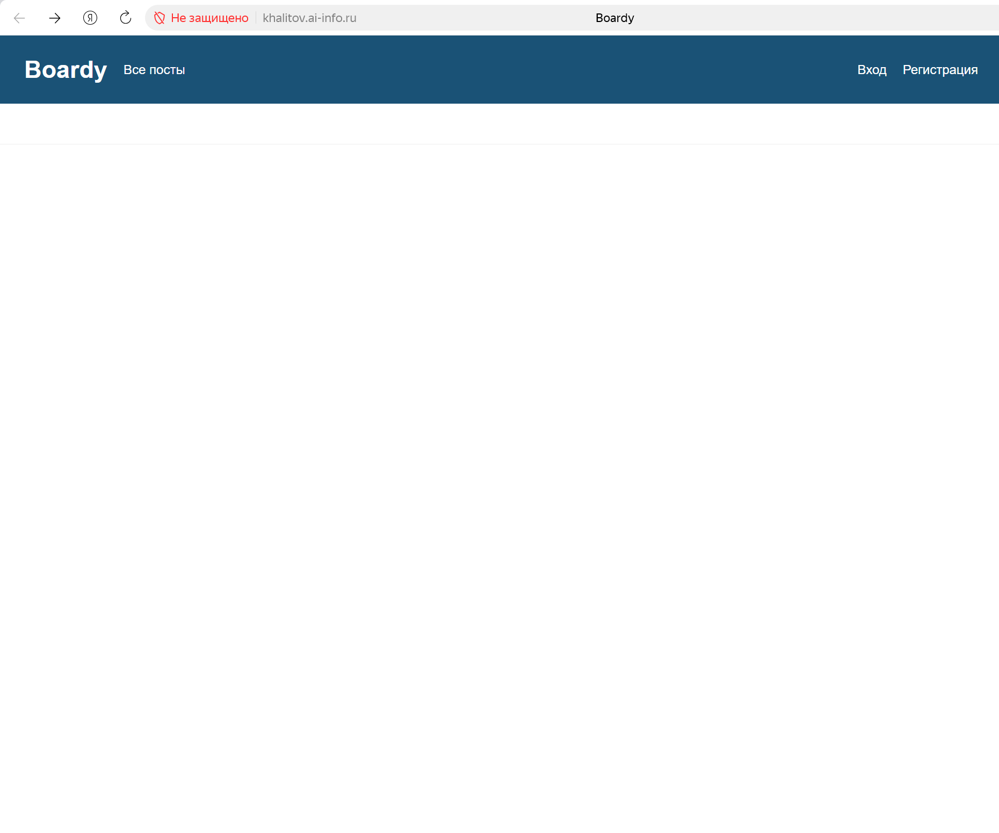

  <strong>Шапка сайта для залогиненного пользователя (по макету 2)</strong> 
  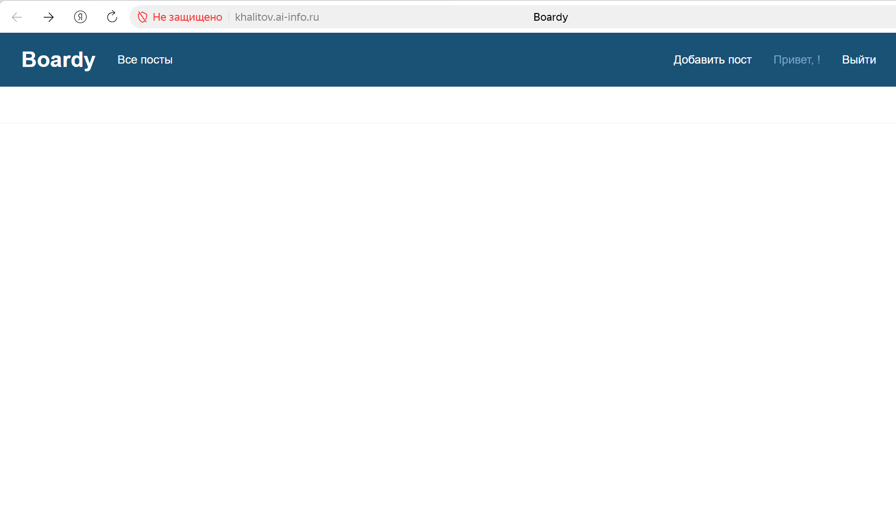

##### Почему меню вынесено в отдельный файл?
Это нужно, чтобы потом можно сразу применять его для нескольких страниц, не переписывая каждый раз одну и ту же разметку.

##### Что изменится если добавить новую ссылку — например, «Избранное»?
Она просто отобразится на странице, и по ней можно будет кликнуть. В зависимости от содержимой ссылки пользователя перенаправит на другую страницу или произойдёт перезагрузка текущей (если пустая).

---

#### Задание 3. Вёрстка форм по макетам

  <strong>Форма регистрации в браузере.</strong> 
  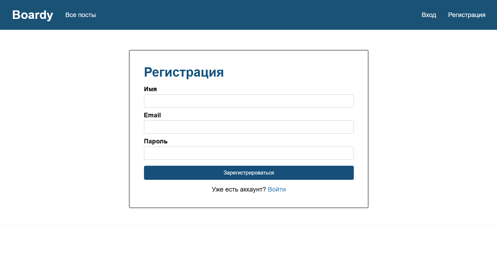

  <strong>Форма входа.</strong> 
  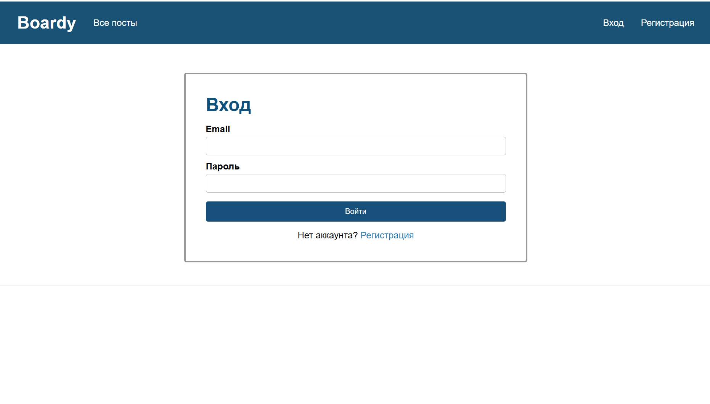

---

### Часть B. Регистрация и логин

#### Задание 4. Регистрация

  <strong>После регистрации на messages.php, в шапке видно имя нового пользователя</strong> 
  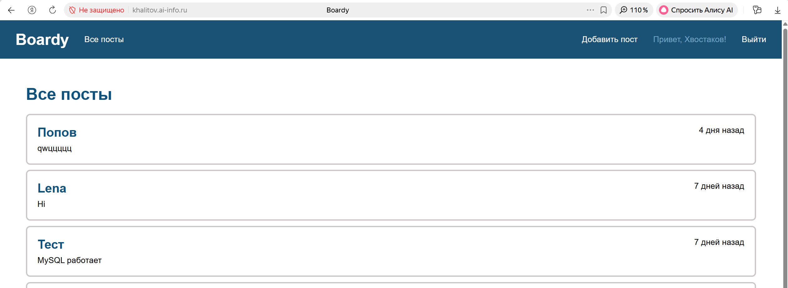

---

#### Задание 5. Хеш в базе

  <strong>SELECT id, name, email, password_hash FROM users</strong> 
  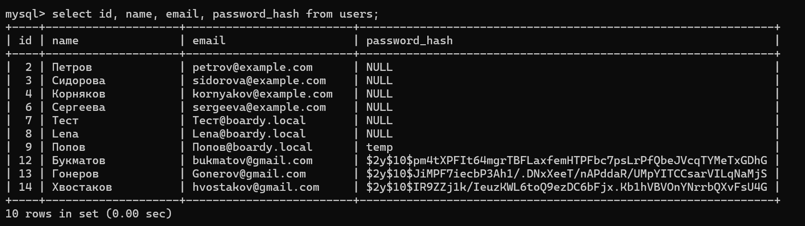

##### Объясните структуру хеша $2y$10$Kx8QnZq... — что означает каждая часть?
$2y$ - Версия алгоритма.
10$ - cost factor.
Kx8QnZq... - соль + хеш

##### Что произойдёт если cost factor увеличить с 10 до 15?
Время хеширования пароля увеличивается экспоненциально, т. е. кол-во итераций увеличится с 2^10 до 2^15.

---

#### Задание 6. Защита от повторной регистрации

  <strong>Сообщение "Email уже занят" на форме</strong> 
  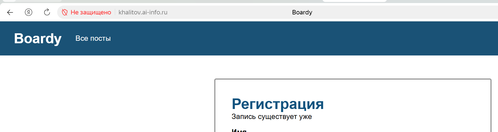

##### Зачем проверять email перед INSERT?
Каждый пользователь должен иметь уникальный email для идентификации.

##### Что произойдёт без этой проверки?
Без это проверки вызовется ошибка в самой БД, так как там прописано, что значения поля email уникальные. Если в БД это не предусмотрено,то создаются дубликаты, из-за этого невозможно понять, кто заходит при логине.

---

#### Задание 7. Логин

  <strong>После логина на messages.php, меню обновилось</strong> 
  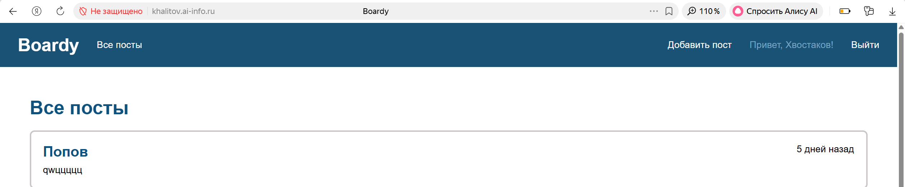

---

#### Задание 8. Неверный пароль

  <strong>Сообщение об ошибке</strong> 
  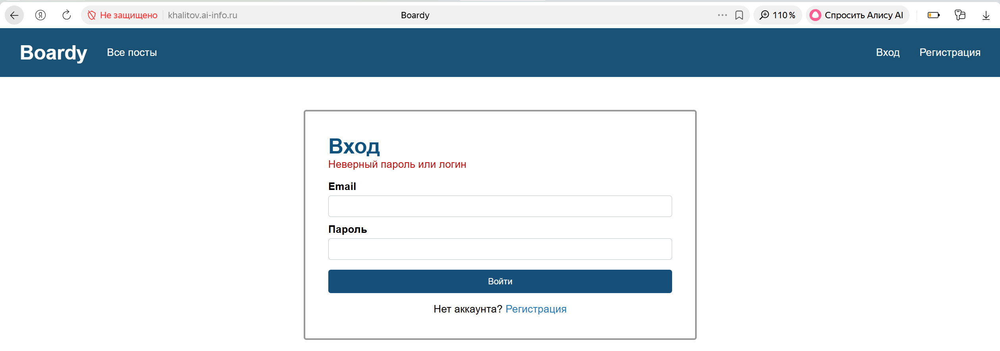

##### Почему сообщение одинаковое и для "email не найден", и для "неверный пароль"?
Нужно это для защиты от перебора и конфиденциальности.

---

### Часть C. Куки и сессии

#### Задание 9. Кука PHPSESSID

  <strong>После логина откройте DevTools → Application → Cookies</strong> 
  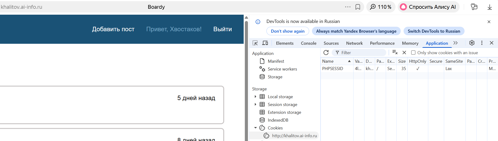

##### Что хранится в значении куки? Это пароль, имя пользователя, что-то ещё?
В значении куки PHPSESSID хранится уникальный случайный идентификатор сессии (длинная строка из букв и цифр).
Там нет пароля, имени пользователя или других личных данных. Это просто случайный «ключ», по которому сервер узнает компьютер пользователя.

##### Откуда берётся значение?
Этот идентификатор автоматически генерируется встроенным механизмом PHP при вызове функции session_start().

---

#### Задание 10. Параметры куки

  <strong>Все три атрибута (HttpOnly, Secure, SameSite) в DevTools</strong> 
  

##### Что изменится если убрать HttpOnly? Как это можно использовать в XSS-атаке?
Если убрать параметр HttpOnly, файлы куки (включая PHPSESSID) станут доступны для чтения и изменения через JavaScript-код прямо в браузере.

---

#### Задание 11. HttpOnly на практике

  <strong>PHPSESSID не виден в document.cookie</strong> 
  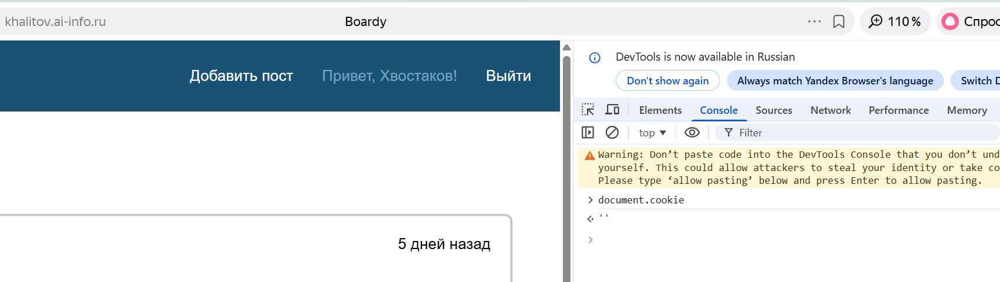

##### Почему PHPSESSID не видна JavaScript, хотя кука существует?
Установлен флаг HttpOnly.

---

#### Задание 12. Файл сессии на сервере

  <strong>Содержимое файла сессии (user_id|i:5;user_name|...)</strong> 
  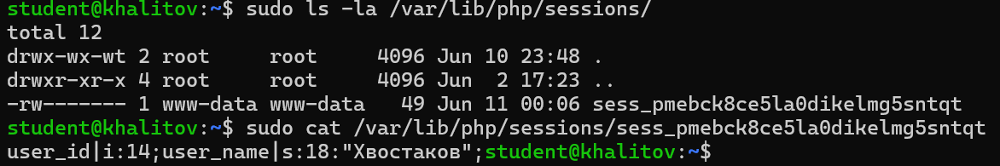

##### Что хранится в файле на сервере? Сравните с тем, что в куке.
На сервере хранятся те данные, которые мы решили разместить. В куках содержится только случайный идентификатор.

##### Почему данные разделены так — одно на клиенте, другое на сервере?
Из соображений безопасностей. В куках данные можно подменить спокойно, а на сервере уже нет. С точки зрения памяти куки не будут много весить, потому что в них содержится только идентификатор сессии.

---

### Часть D. Защита и доработка

#### Задание 13. Защита страниц

  <strong>302 redirect на /login.php (без куки)</strong> 
  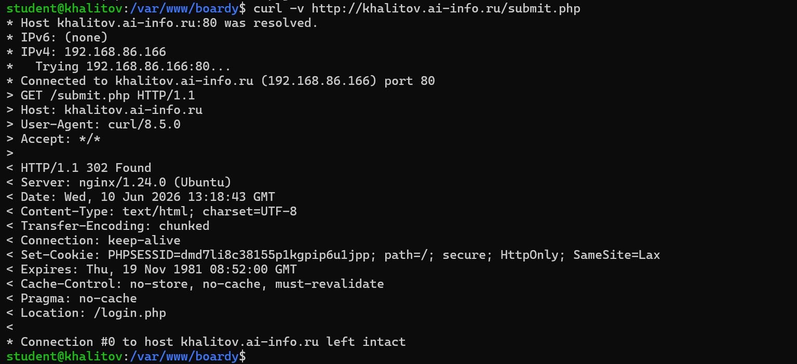

---

#### Задание 14. Посты с автором

  <strong>Лента постов по макету 2, с разными именами авторов</strong> 
  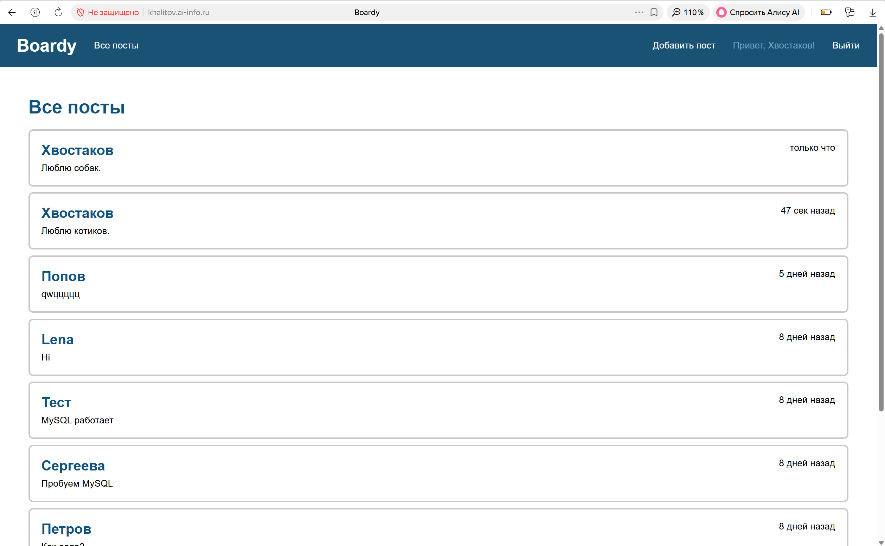

##### Напишите SQL с JOIN, которым вы тянете посты.
SELECT p.id, p.body, p.created_at, u.name AS author_name
FROM posts p
JOIN users u ON p.author_id = u.id;

##### Почему JOIN, а не два отдельных запроса?
Удобней решать задачу прибегая только к одному запросу, а не через их множество (даже если 2). Да и по времени быстрее выходит, когда ты БД обращаешься только один раз.

---

#### Задание 15. Добавление поста

  <strong>Форма добавления поста по макету 5</strong> 
  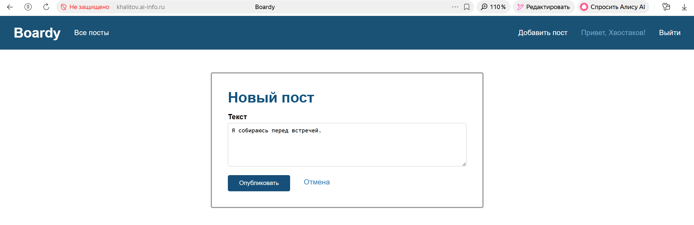

---

#### Задание 16. Logout

  <strong>После logout меню снова гостевое</strong> 
  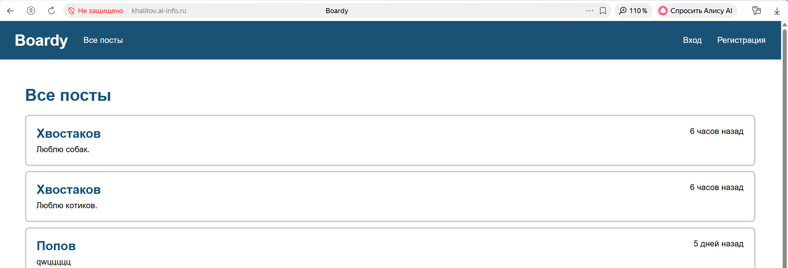

  <strong>DevTools → Cookies → PHPSESSID удалена</strong> 
  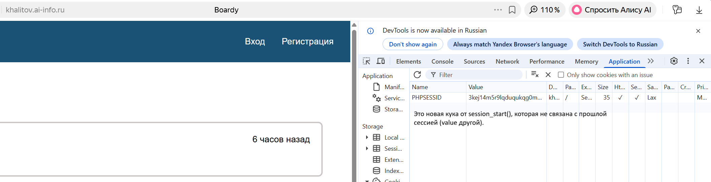

##### Что делает session_destroy()?
Удаляет файл сессии.

##### Зачем ещё и setcookie() с прошедшей датой?
Делаем куку просроченной. Браузер это понимает и удаляет её.

##### Что останется если сделать только одно из двух?
Без setcookie — кука останется в браузере, укажет на несуществующий файл. Будет работать, но неаккуратно.
Без session_destroy — данные на сервере будут висеть до gc (24 минуты), кто-то может воссоздать куку вручную.

---

#### Задание 17. Истёкшая сессия

  <strong>Редирект на login.php, хотя кука в браузере есть</strong> 
  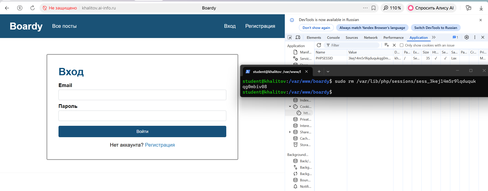

##### Почему браузер считает себя залогиненным (есть кука), а сервер — нет?
Потому что на сервера нет файла с тем идентификатором, который есть в куке.
