1. вывод ssh-keygen и ls
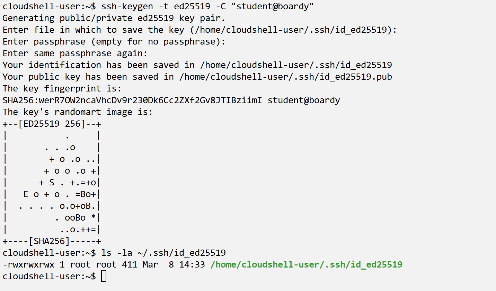

2. панель VK Cloud с VPS (IP виден)
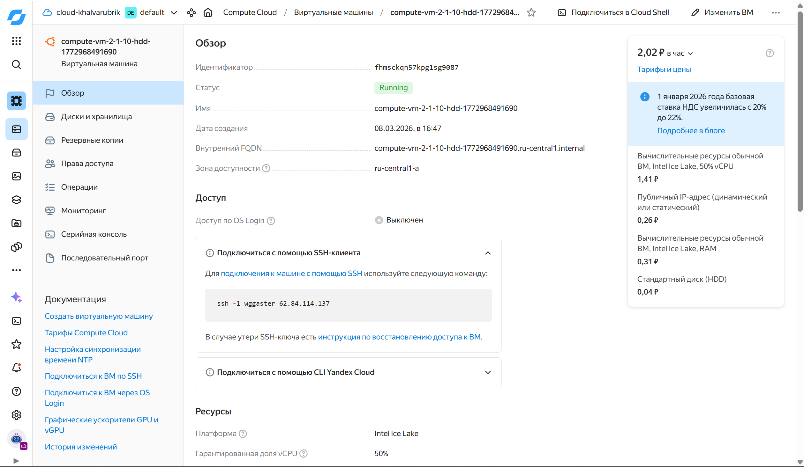

3. правила файрвола
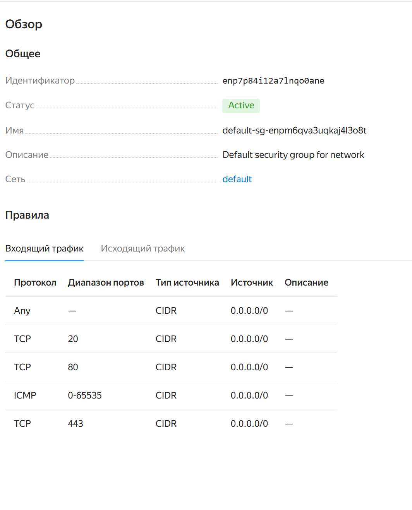
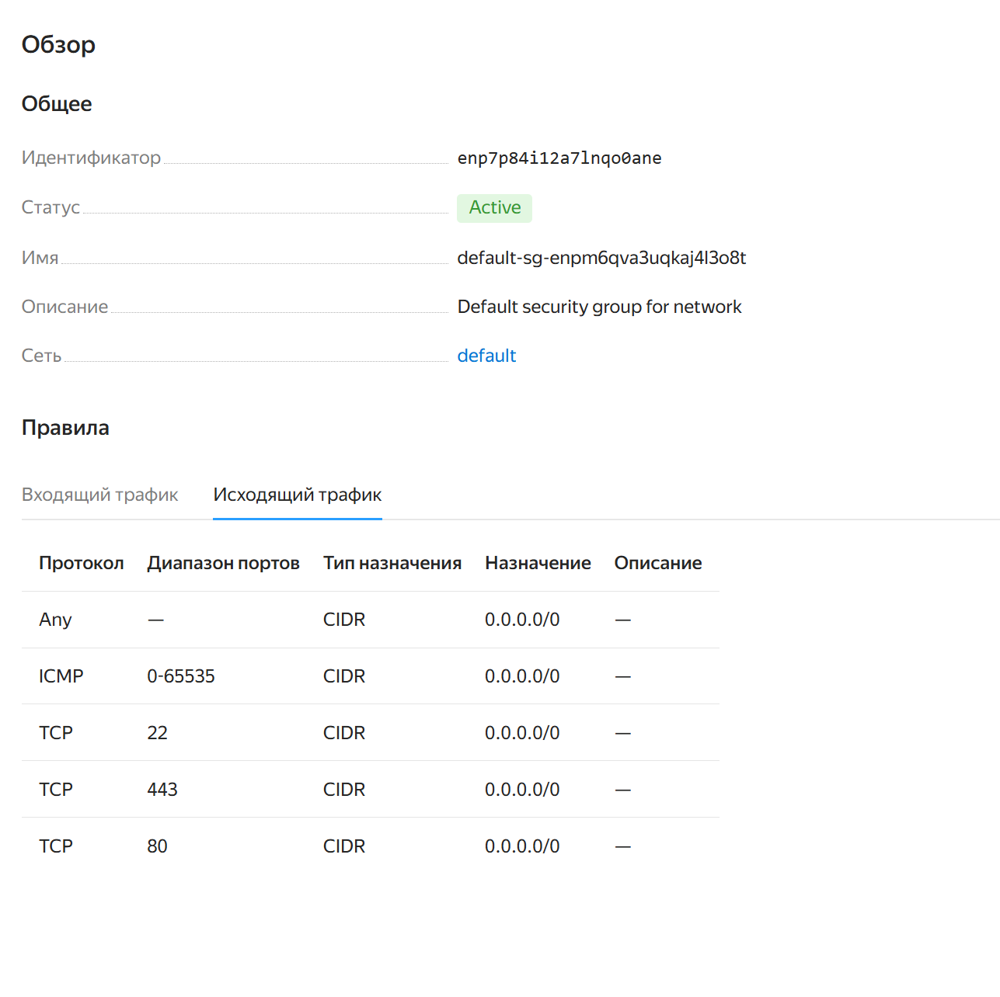

4. терминал PuTTY после подключения
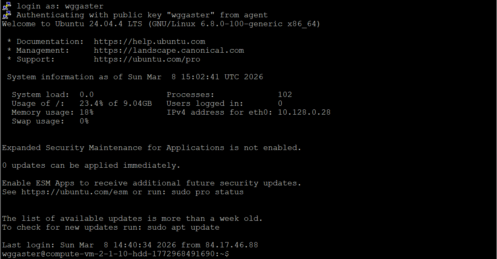

5. hostname (фамилия) + timedatectl (Moscow)
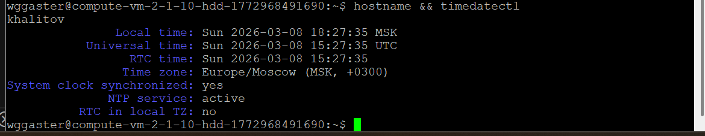

6. приглашение student@фамилия:~$
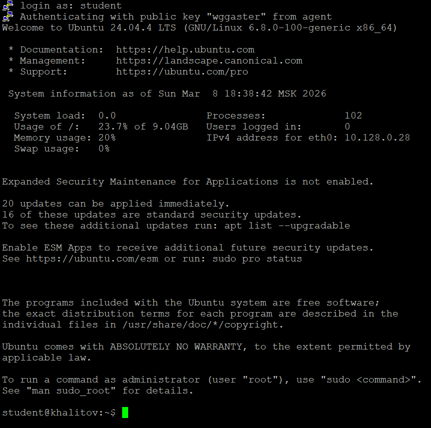

7. конфигурация git
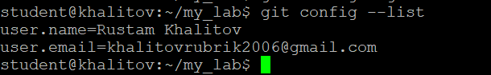

8. проверка подключения сервера к git через ssh
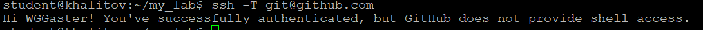

9. репозиторий на GitHub с папками Lab/
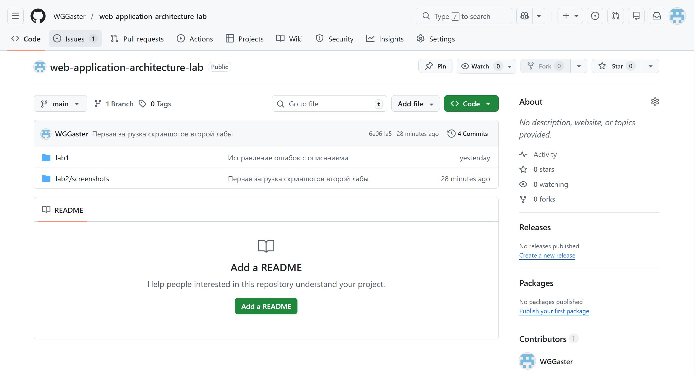

10. созданный PR на GitHub (видно diff)
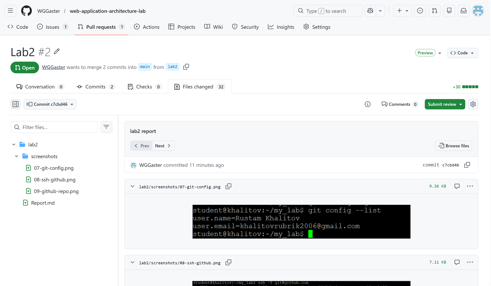
