1. Вывод systemctl status nginx (active)
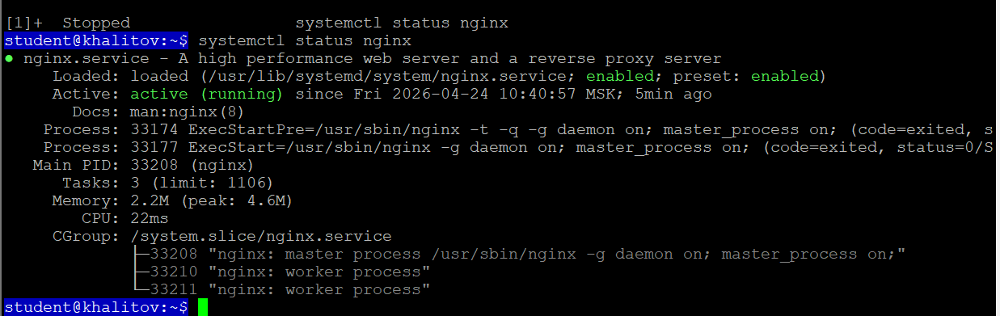
---
2. «Welcome to nginx!» в браузере (IP виден в адресной строке)
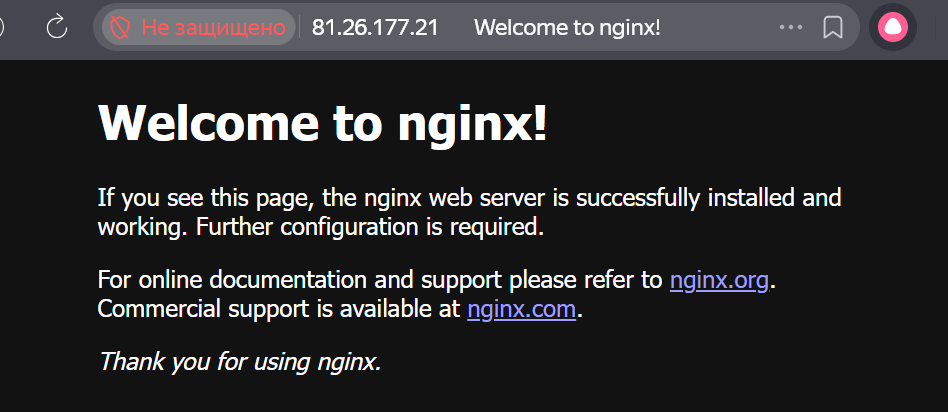
---
3. Вывод curl -v
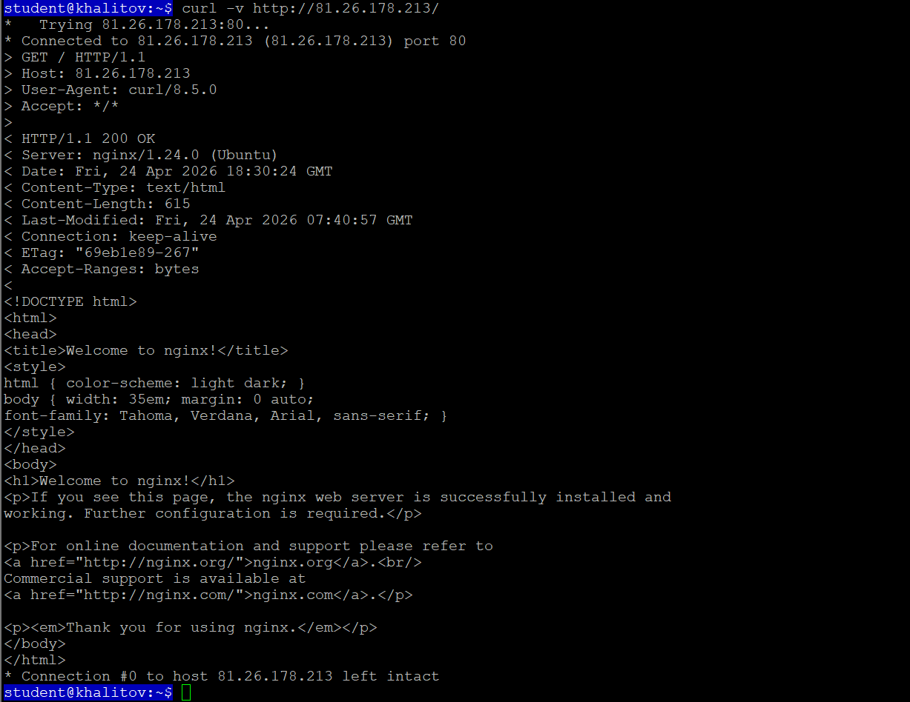
---
4. Вывод ls -la /var/www/ ДО и ПОСЛЕ chown
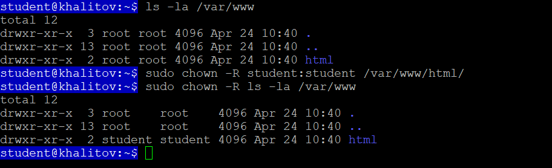
---
cat /etc/nginx/sites-available/default

listen: 80 default_server #прослушивание указанного порта

root: /var/www/html #корневая папка веба

server_name: _ #имя сервера

index: index.html index.htm index.nginx-debian.html; #порядок поиска индексного файла

---
5. Панель VK Cloud с созданной зоной
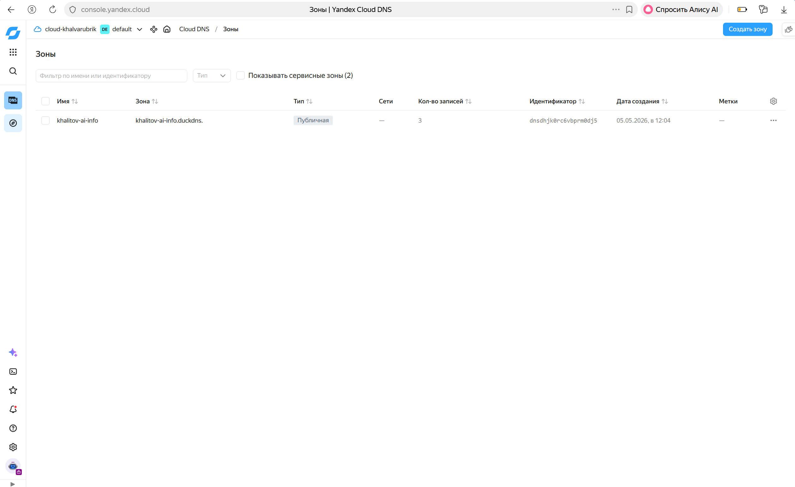
---
6. A-запись в панели VK Cloud (домен, IP, TTL видны)
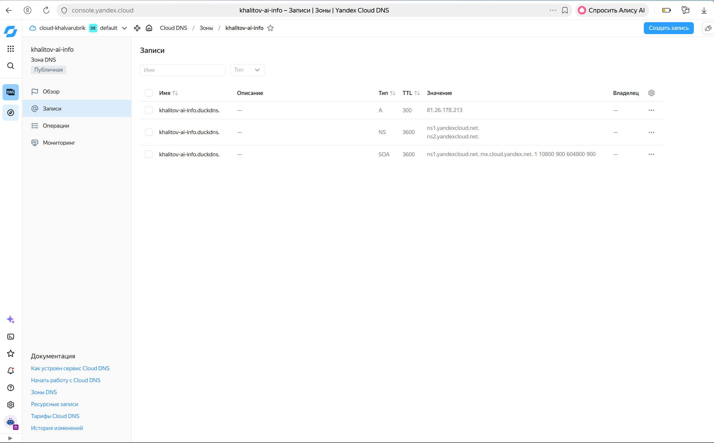
---
7. Вывод ping (домен резолвится в IP VPS)
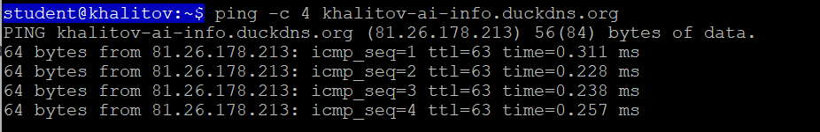
---
8. Вывод dig с подписями
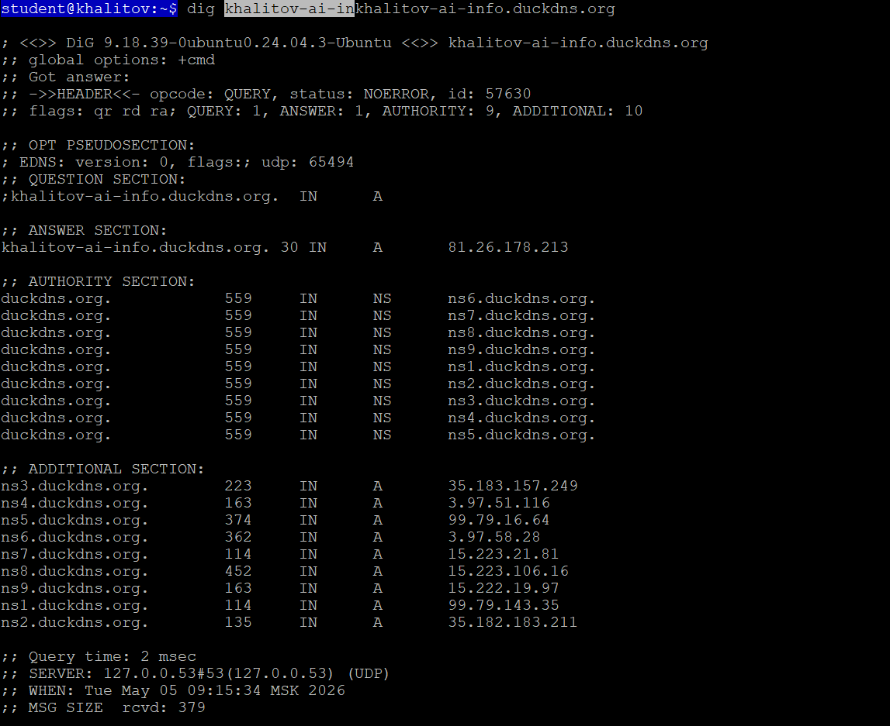
QUESTION SECTION: ;khalitov-ai-info.duckdns.org.  IN      A
ANSWER SECTION: khalitov-ai-info.duckdns.org. 30 IN     A       81.26.178.213
SERVER: 127.0.0.53#53(127.0.0.53) 
---
9. Вывод dig +trace
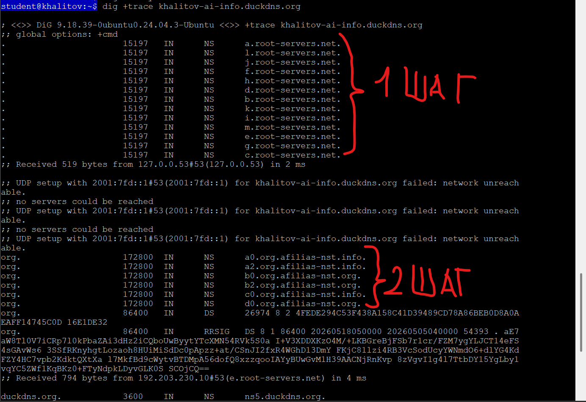
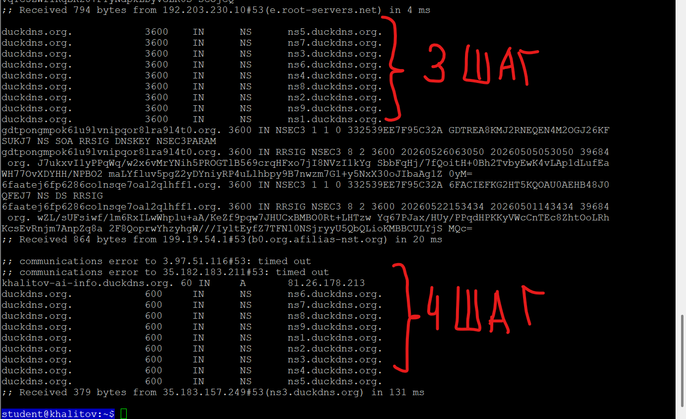
---
10. Страница Nginx в браузере (домен виден в адресной строке)
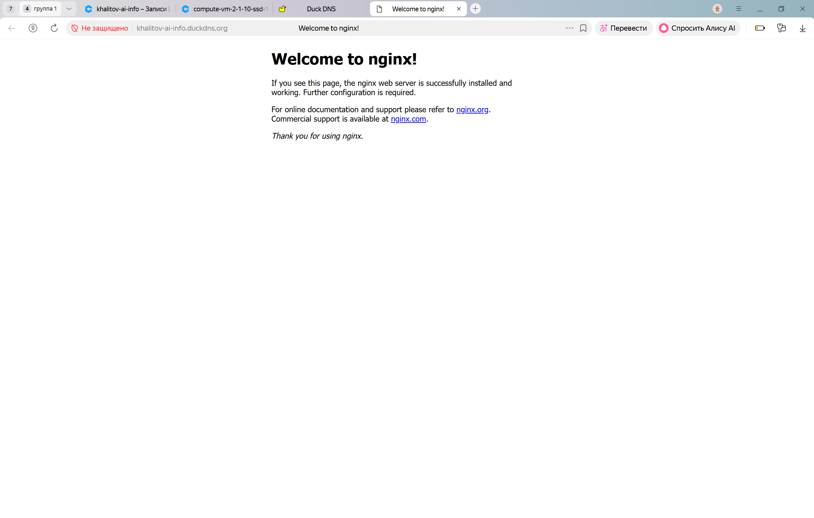