# Отчет по лабораторной работе №4
**Тема:** HTTP, виртуальные хосты, проект Boardy

---

### Часть А. Виртуальный хост основного сайта

#### Задание 1. Директория проекта
Вывод ls -la /var/www/ (видно boardy, владелец student)

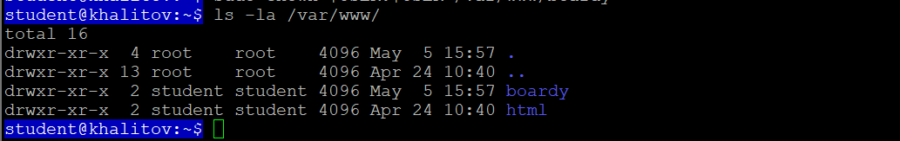

---

#### Задание 2. Конфиг виртуального хоста
Вывод cat /etc/nginx/sites-available/boardy (полный конфиг)

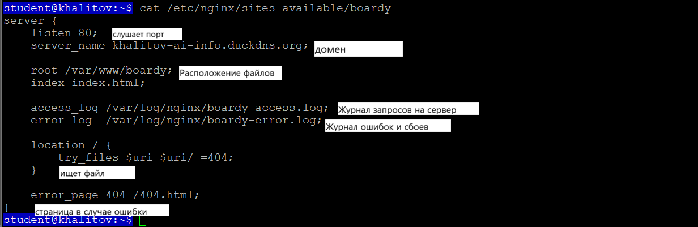

---

### Часть B. Страницы проекта

#### Задание 3. Лендинг
Лендинг в браузере (домен виден в адресной строке)

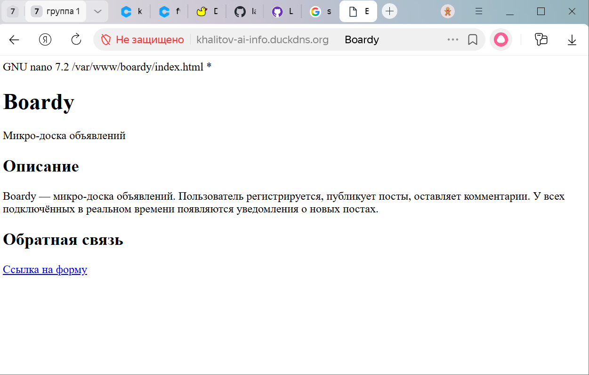

---

#### Задание 4. Форма обратной связи
Форма в браузере
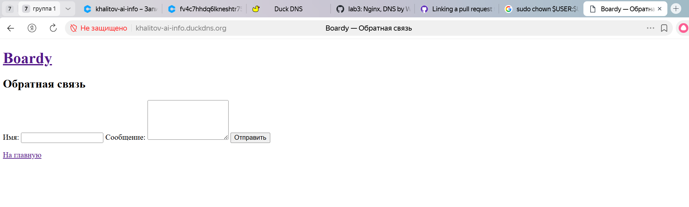

---

#### Задание 5. Стили и 404
Кастомная 404-страница в браузере (URL несуществующей страницы виден)

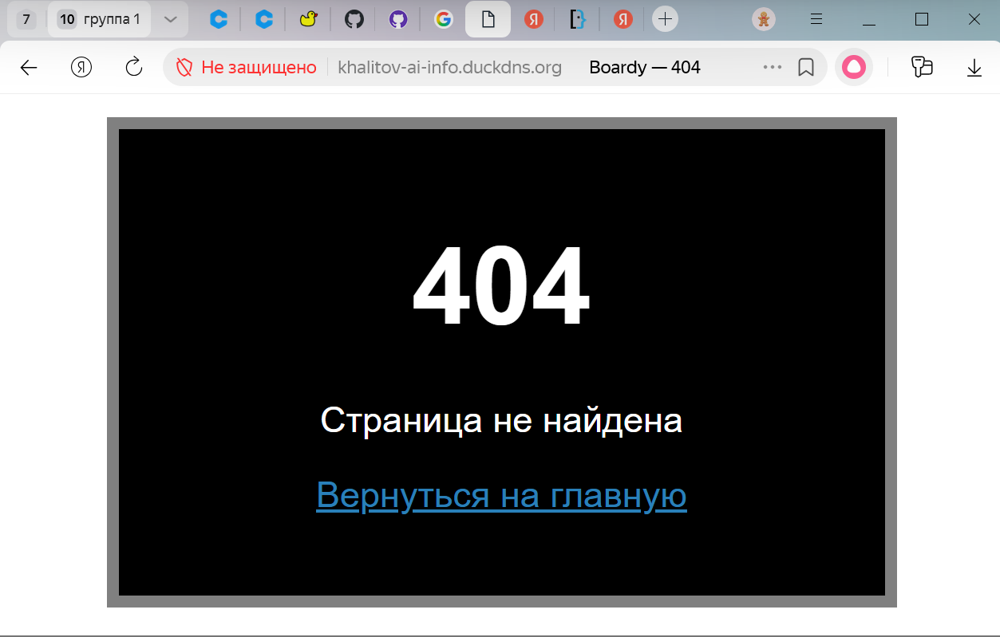

---

### Часть C. Второй виртуальный хост — API

#### Задание 6. DNS-запись для поддомена
A-запись в панели VK Cloud (поддомен api, IP, TTL видны)

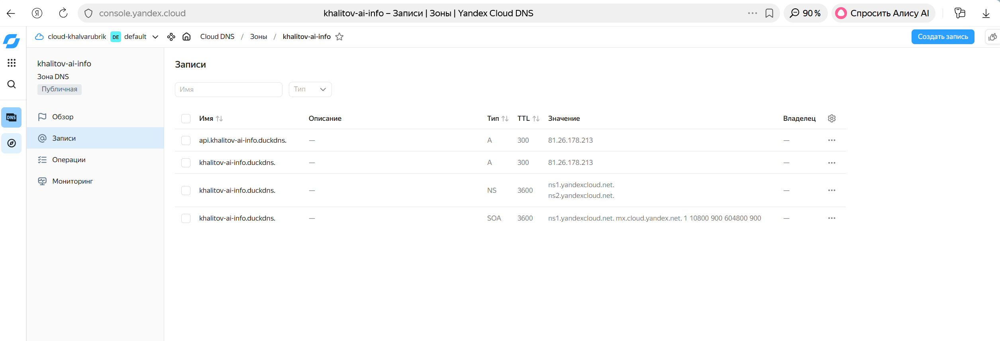

---

#### Задание 7. Проверка DNS
Вывод dig (IP вашего VPS)

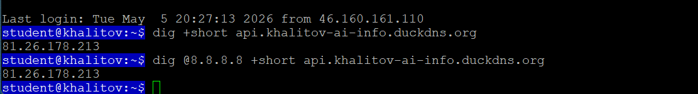

---

#### Задание 8. Конфиг и заглушка API
Вывод cat /etc/nginx/sites-available/boardy-api

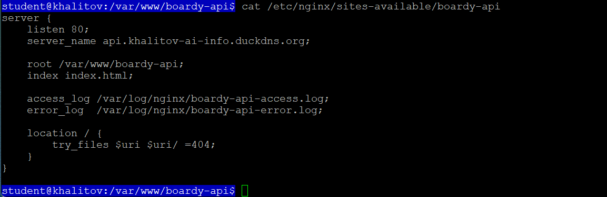

Заглушка API в браузере (api.фамилия.ai-info.ru виден в адресной строке)

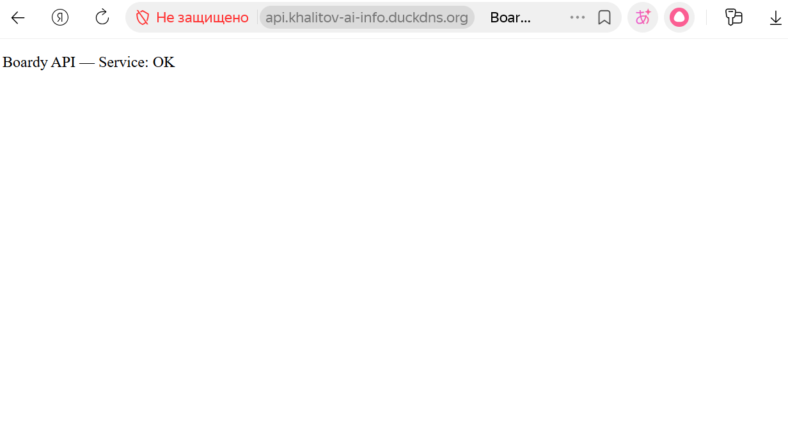

---

### Часть D. Исследование HTTP

#### Задание 9. GET-запрос через curl -v
Вывод curl -v с подписями

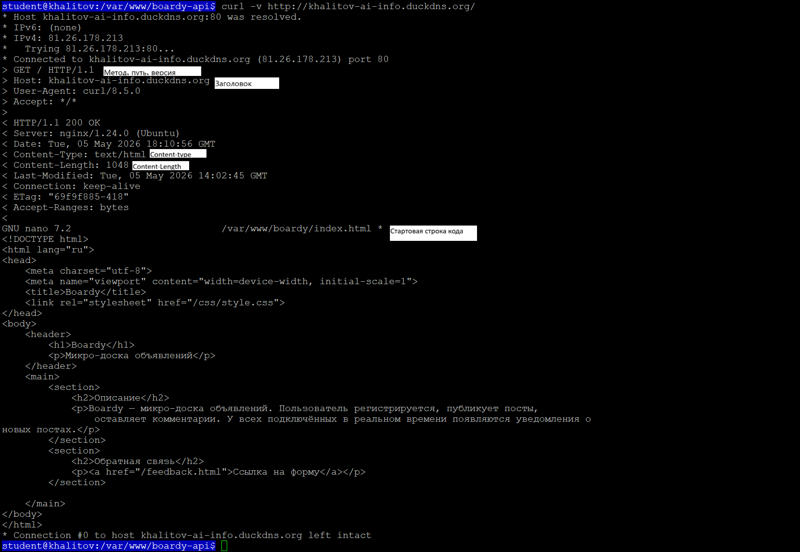

---

#### Задание 10. Виртуальные хосты в действии
Три запроса и три разных ответа

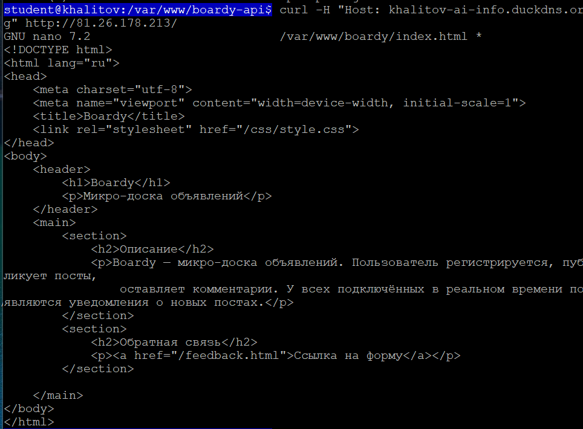
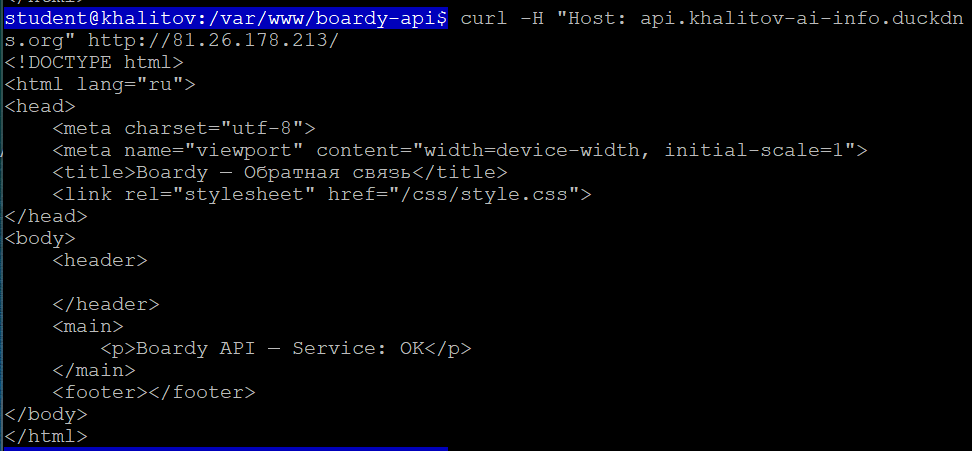
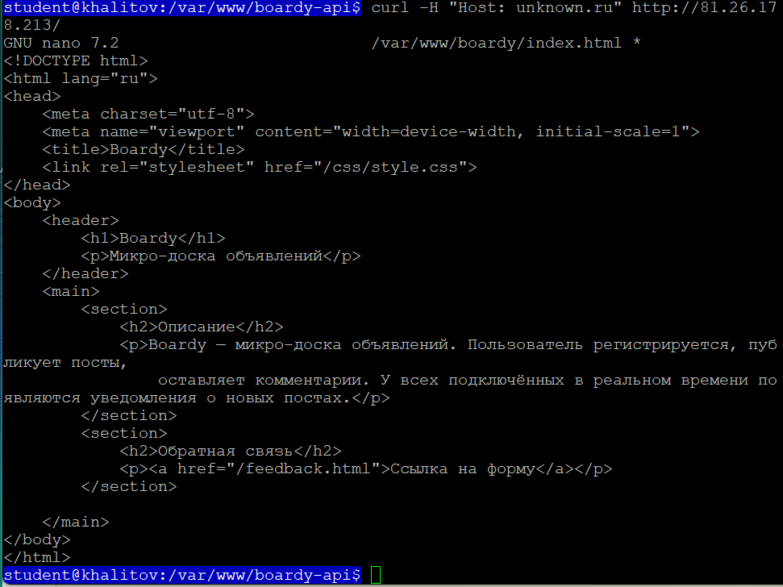

К одному ip привязаны домены, по которым nginx по их конфигурациям определяет, какое содержимое использовать для отображения в браузере
При неизвестном адресе (например, "unknown.ru") nginx сначала пытается найти default_server. Если этого не получается сделать, то тогда выбирается самый первый конфиг (т. е. khalitov-ai-info.duckdns.org)

---

#### Задание 11. POST-запрос
Вывод curl -v с POST-запросом

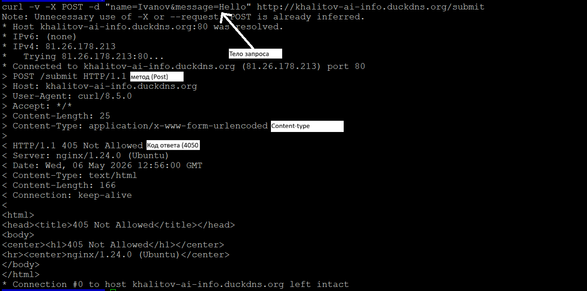

Метод POST не был раннее реализован, в отличие от GET, поэтому будет выдаваться соответствующая ошибка.

---

#### Задание 12. HEAD-запрос
Чем отличается ответ на HEAD от GET? Зачем нужен HEAD?

GET и HEAD.
HEAD возвращает заголовок ответа, а GET - кроме этого ещё и сам результат.
HEAD нужен для просмотра метаданных ответа без самого ответа, который сам по себе для какого-либо анализа не нужен.

---

### Часть E. Логи

#### Задание 13. Раздельные логи
Вывод обоих логов (видно, что запросы разделены)

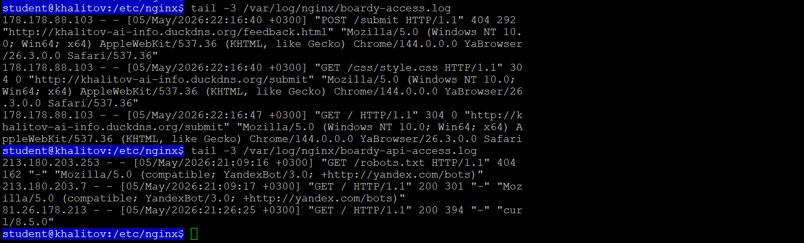

IP: 178.178.88.103
Метод: POST
Путь: /submit
Код ответа: 404
User-Agent: Mozilla/5.0

---

#### Задание 14. Фильтрация логов
Статистика кодов ответа

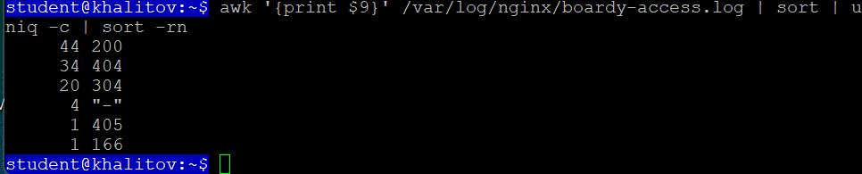

---

#### Сдача через Pull Request
Созданный PR на GitHub

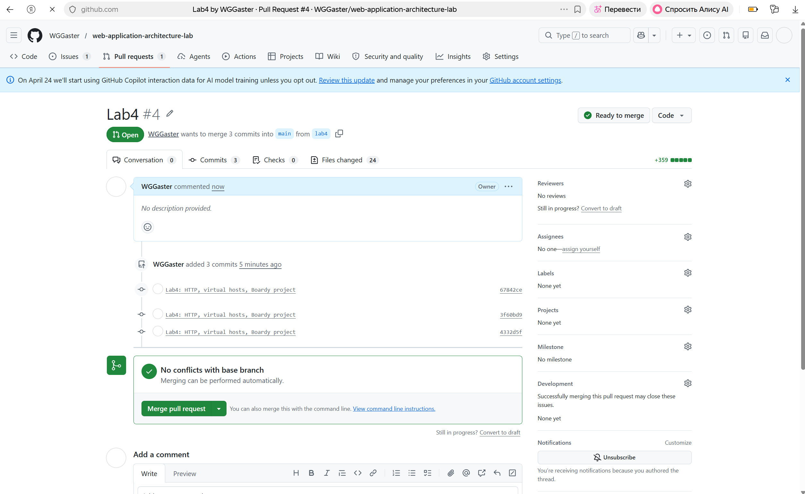