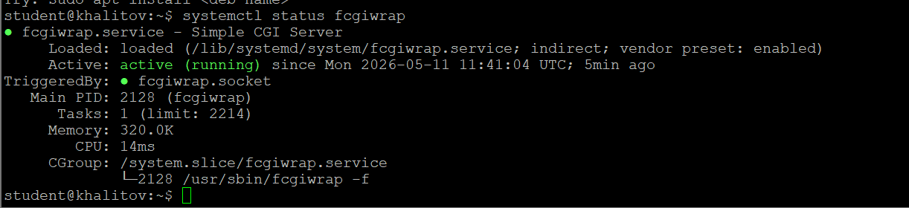
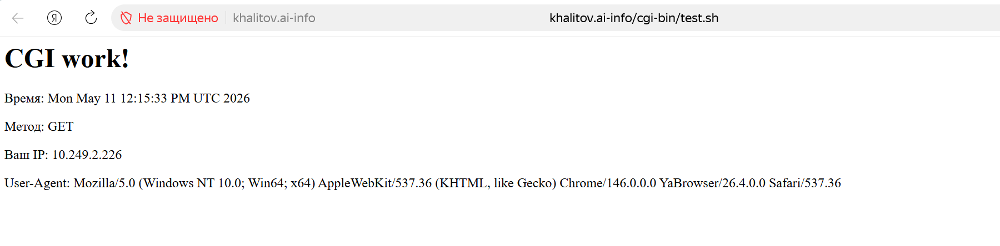
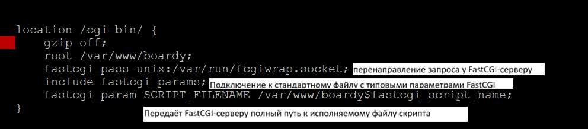
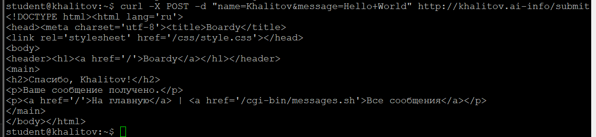
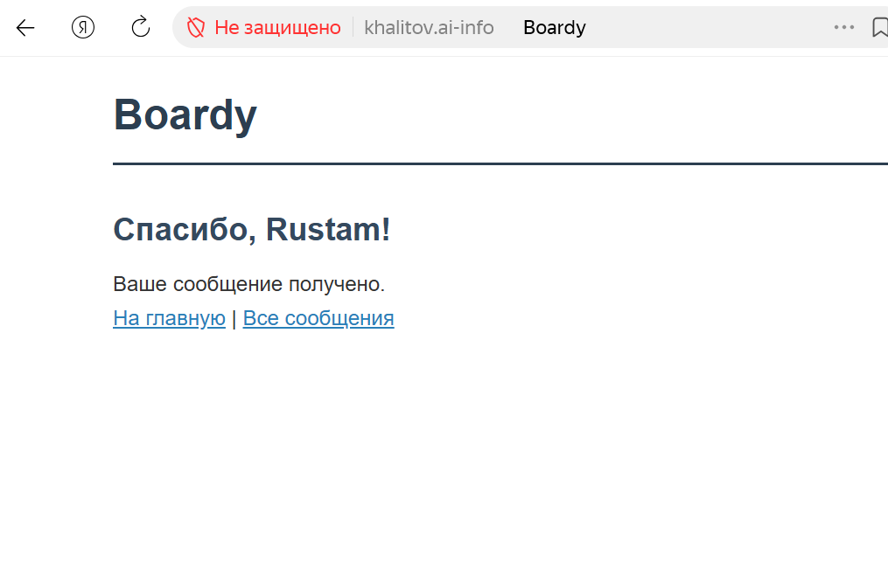
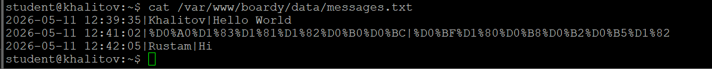
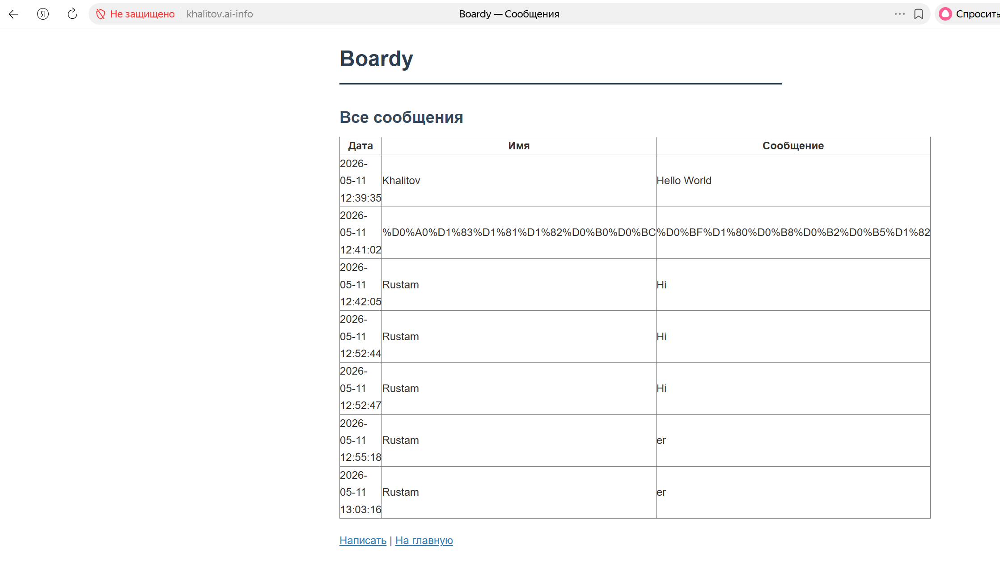
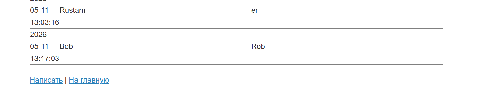
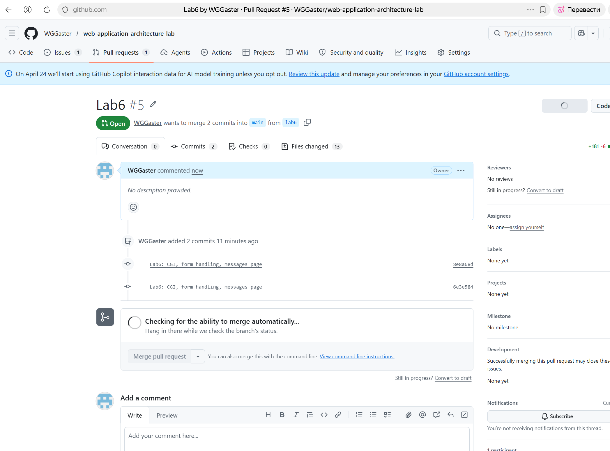

# Отчет по лабораторной работе №6
**Тема:** CGI: Boardy оживает

---

### Часть А. CGI-скрипт

#### Задание 1. Установка fcgiwrap
Вывод systemctl status fcgiwrap (active)

---

#### Задание 2. Тестовый скрипт
Результат в браузере (время, метод GET, IP)

---

#### Задание 3. Конфигурация Nginx
Добавленный блок location в конфиге

**Объяснение директив:**
*   `fastcgi_pass`: указывает путь к Unix-сокету fcgiwrap для передачи запроса.
*   `include fastcgi_params`: подключает стандартные переменные окружения FastCGI.
*   `SCRIPT_FILENAME`: передает полный путь к скрипту, который должен выполнить fcgiwrap.

---

### Часть B. Форма Boardy

#### Задание 4. Скрипт обработки формы
Вывод curl -X POST -d "name=...&message=..." (ответ «Спасибо»)

---

#### Задание 5. Форма в браузере
Страница «Спасибо, {ваше имя}!» в браузере

---

#### Задание 6. Данные на диске
Содержимое файла (минимум 3 сообщения)

---

### Часть C. Страница сообщений

#### Задание 7. Скрипт вывода сообщений
Страница сообщений в браузере (таблица с данными)

---

#### Задание 8. Полный цикл
Новое сообщение в таблице

---

### Часть D. Анализ

#### Задание 9. Путь запроса
**Схема пути POST-запроса:**
Браузер → HTTPS → Nginx → FastCGI → fcgiwrap → submit.sh → stdin → messages.txt → stdout → Nginx → браузер.

---

#### Задание 10. Теоретические вопросы
1. **Что такое CGI и какую проблему он решил в 1993 году?** 
CGI (Common Gateway Interface) — это стандартный протокол, позволяющий веб-серверу запускать внешние программы (скрипты) и передавать им данные от клиента, а затем возвращать результат клиенту в виде динамической HTML-страницы.
До появления CGI веб-серверы умели отдавать только статические файлы (HTML, изображения). Любой интерактив был невозможен.

2. **Как CGI-скрипт получает данные POST-запроса?** 
CGI-скрипт получает POST-данные через стандартный ввод (stdin).
Длина данных передаётся через переменную окружения CONTENT_LENGTH.

3. **Почему CGI создаёт проблемы при высокой нагрузке?** 
Во-первых, создаётся новый процесс для каждого запроса. Во-вторых, постоянное соединение не поддерживается.

4. **Чем отличается fastcgi_pass от proxy_pass?** 
proxy_pass перенаправляет HTTP-запросы на другой HTTP-сервер.
fastcgi_pass отправляет запросы на сервер, работающий по протоколу FastCGI

5. **Зачем нужен fcgiwrap, если Apache запускает CGI напрямую?** 
nginx не умеет запускать CGI-программы напрямую, а его конкурент Apache — умеет. fcgiwrap покрывает собой этот недостаток первого.

### Сдача через Pull Request
