# Отчет по лабораторной работе №7
**Тема:** PHP-FPM и FastAPI для Boardy

---

### Часть A. PHP-FPM

#### Задание 1. Установка PHP-FPM
Php -v и systemctl status php*-fpm
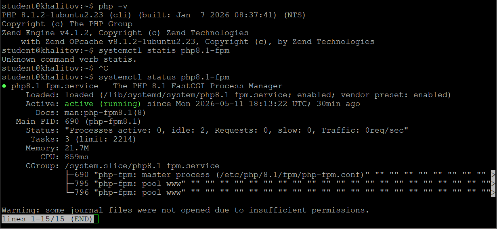

---

#### Задание 2. Форма и сообщения на PHP
Отправка формы, ответ «Спасибо»
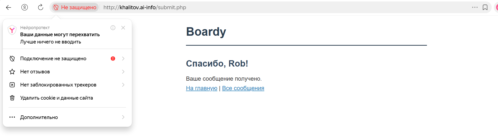

Messages.php с таблицей (мин. 3 сообщения)
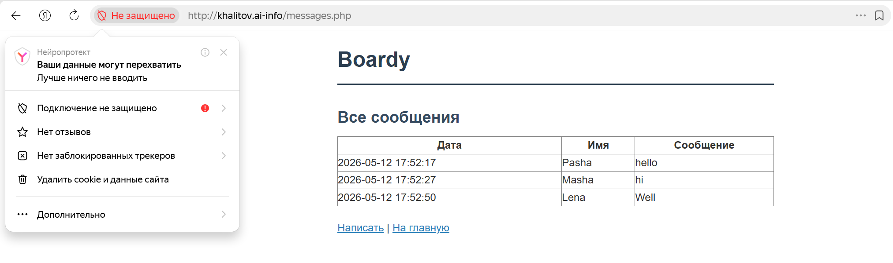

---

#### Задание 3. Конфиг Nginx для PHP
Конфиг с fastcgi_pass
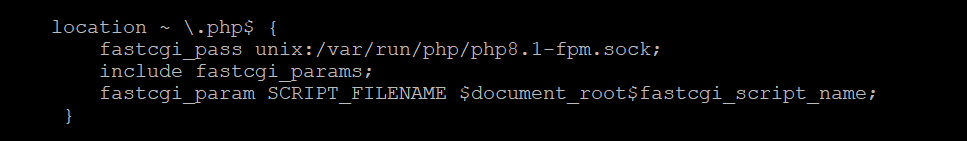

---

#### Задание 4. Shared nothing
Три вызова, каждый раз «Счётчик: 1»
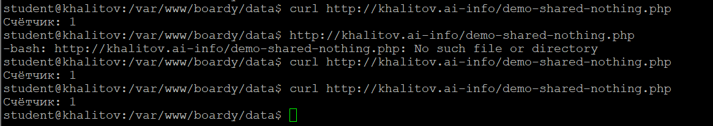

---

#### Задание 5. Блокировка воркеров
Время выполнения 10 параллельных запросов
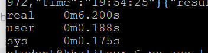

---

### Часть B. FastAPI

#### Задание 6. Установка и приложение
Curl .../api/status (JSON)
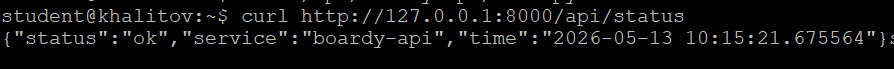

Curl .../api/messages (JSON с данными)
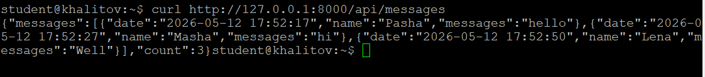

---

#### Задание 7. Живой процесс (счётчик)
Счётчик растёт: 1, 2, 3
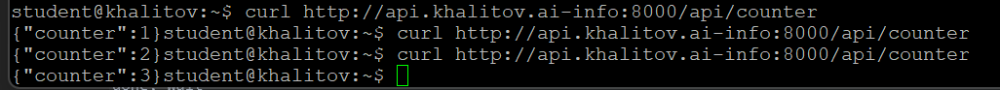

---

#### Задание 8. Async: 10 запросов за 2 секунды
10 запросов, общее время ~2 сек
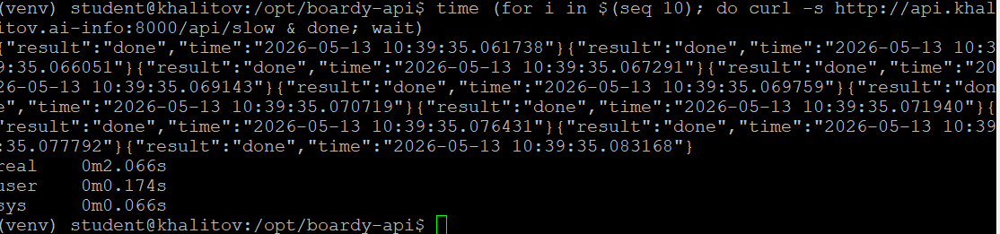

---

#### Задание 9. Блокирующий код убивает event loop
5 запросов, общее время ~10 сек
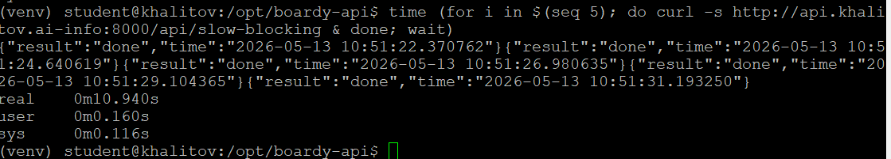

---

#### Задание 10. Swagger
Swagger-документация
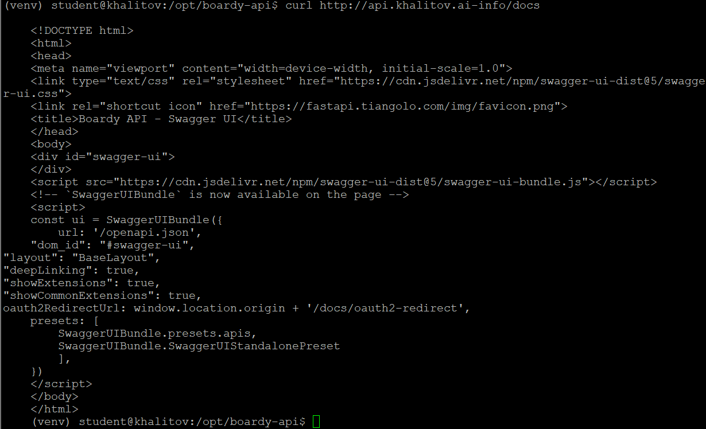

---

#### Задание 11. systemd-сервис
Systemctl status boardy-api (active)
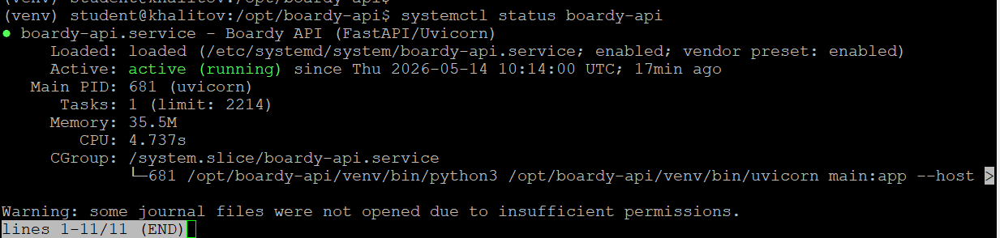

---

#### Задание 12. Nginx proxy_pass
Конфиг с proxy_pass
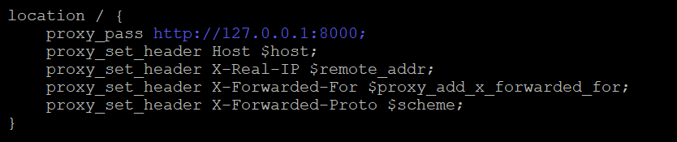

---

### Часть C. Сравнение

#### Задание 13. Два формата
HTML vs JSON
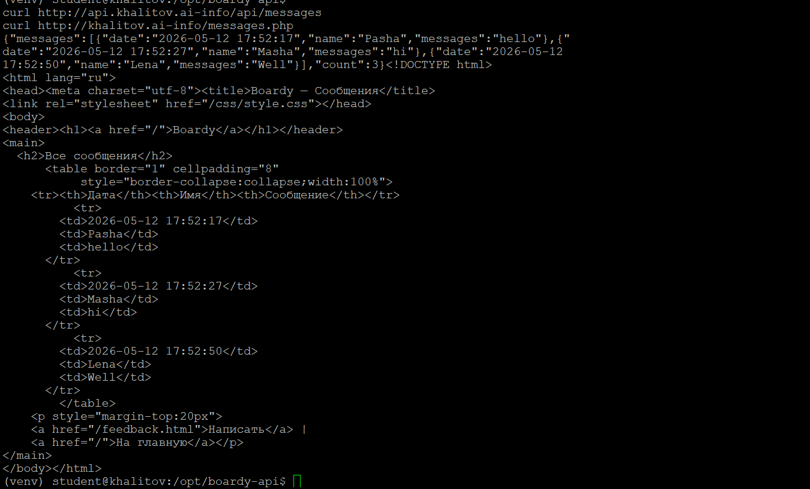

---

#### Задание 14. Процессы
Пул PHP-FPM и один Uvicorn
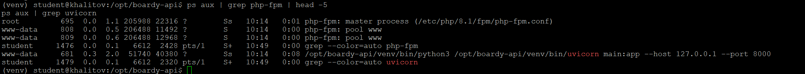

---

### Сдача через Pull Request

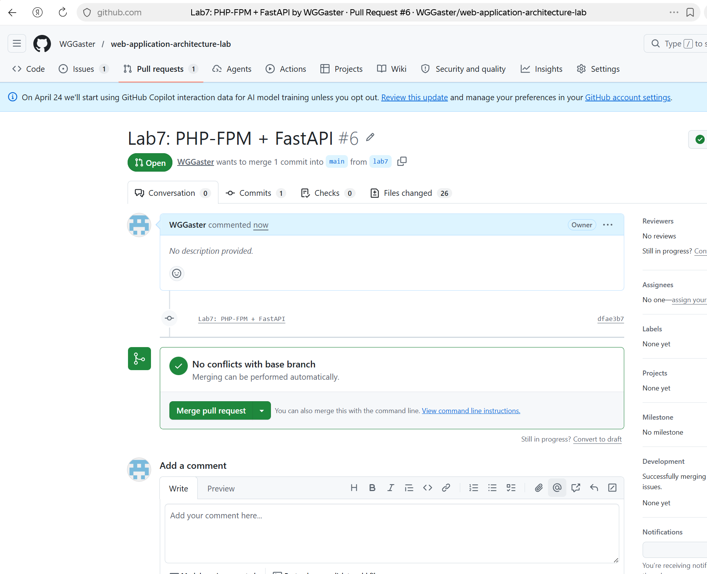