# Отчет по лабораторной работе №8
**Тема:** MySQL: от файла к базе данных

---

### Часть A. MySQL — установка и настройка

#### Задание 1. Установка MySQL
Systemctl status mysql + mysql --version
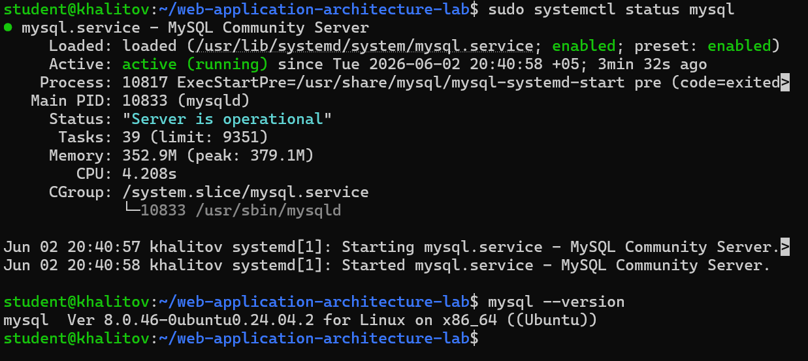

---

#### Задание 2. База данных и пользователь
SELECT @@character_set_database, @@collation_database;
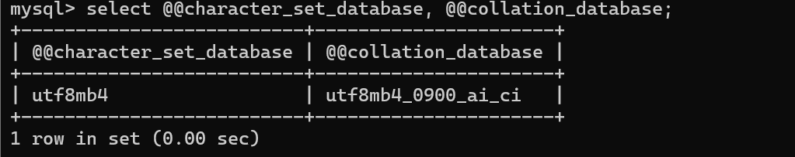

##### Почему utf8mb4, а не utf8?
В utf8mb4 входят эмодзи, а в utf8 - нет.

##### Что такое collation и зачем unicode_ci?
Collation - это правило сравнения.
Unicode_ci нужен для точного сравнения по Unicode-правилам.

---

#### Задание 3. phpMyAdmin
Главная страница phpMyAdmin с базой boardy
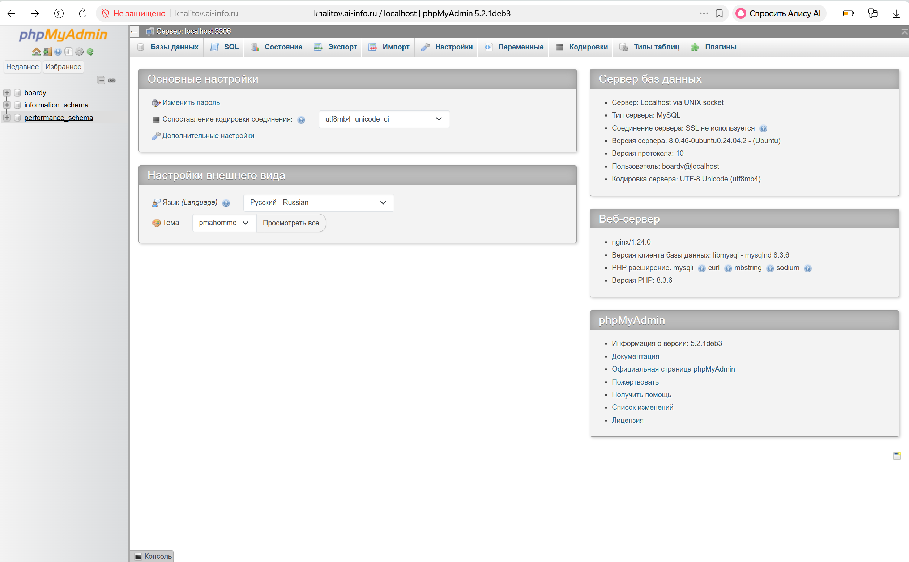

---

### Часть B. Таблицы и связи

#### Задание 4. Три таблицы
SHOW TABLES; + DESCRIBE posts;
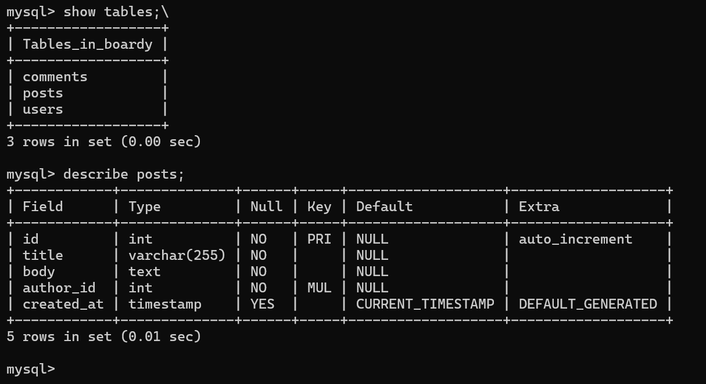

Структура таблицы posts в phpMyAdmin (столбцы, типы, ключи)
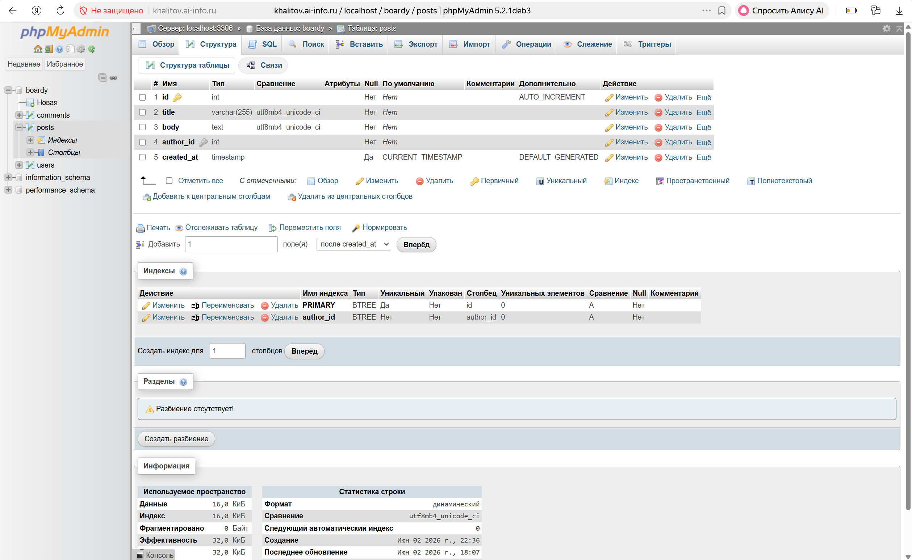

##### Что такое FOREIGN KEY и ON DELETE CASCADE? Зачем?
FOREIGN KEY — это внешний ключ, которое связывает поле одной таблицы с первичным ключом другой таблицы.
Он обеспечивает ссылочную целостность данных.

ON DELETE CASCADE (Каскадное удаление) — это правило поведения внешнего ключа при удалении родительской записи. Она означает: «Если удаляется главная запись, автоматически удали все связанные с ней зависимые записи».
Оно нужно для предотвращения появления «сиротских» записей, которые засоряют базу и ломают логику приложения.

#### Какой движок используется и почему?
По умолчанию используется движок InnoDB.
Нужен для поддержки foreign key, транзакционности, блокировки на уровне строк, crash recovery.

---

#### Задание 5. SQL-скрипт
Содержимое schema.sql
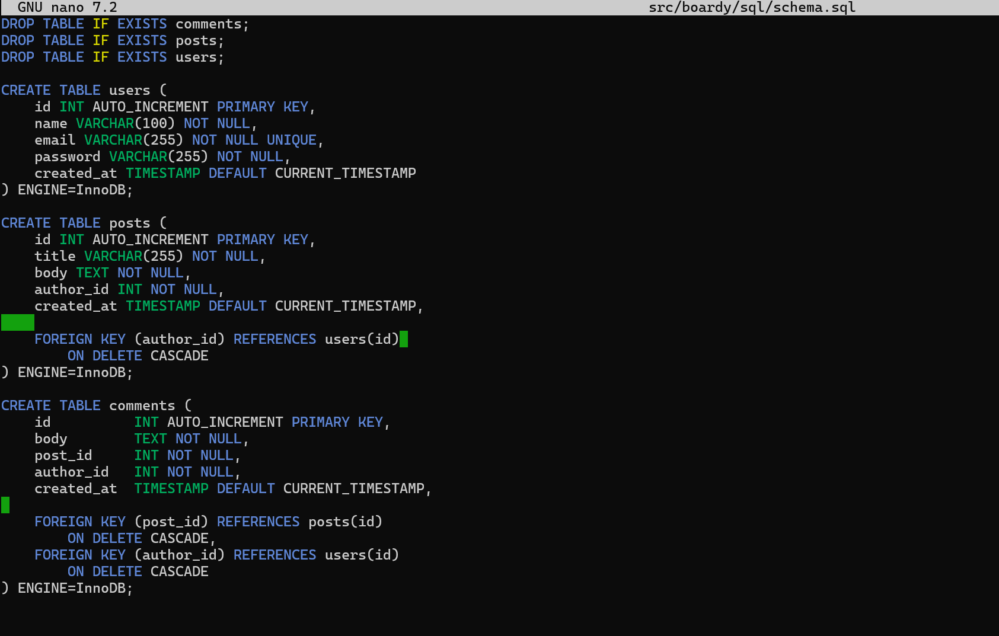

---

### Часть C. SQL — базовые операции

#### Задание 6. INSERT
SELECT * FROM users; + SELECT * FROM posts;
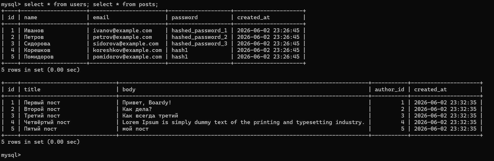

Вкладка «Обзор» таблицы posts в phpMyAdmin
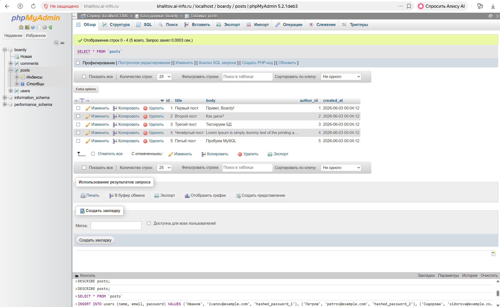

---

#### Задание 7. SELECT + JOIN
Результат (в CLI или phpMyAdmin → SQL)
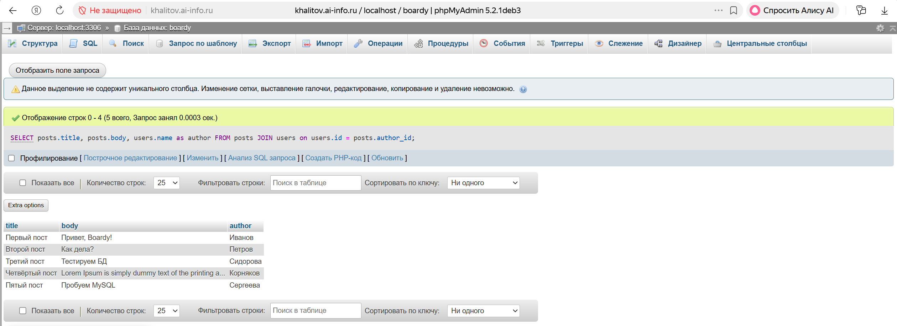

##### Зачем JOIN? 
JOIN нужен для горизонтального объединения таблиц по общему условию (например, по совпадение главного ключа таблицы A и внешнего ключа таблицы B).

##### Как получить имя автора без него?
SELECT posts.title, posts.body, users.name AS author
FROM posts, users
WHERE posts.author_id = users.id;

---

#### Задание 8. Foreign Key — защита целостности
Ошибка (Cannot add or update a child row)
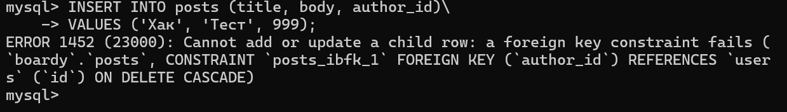

---

#### Задание 9. CASCADE
COUNT до и после DELETE (CLI или phpMyAdmin)
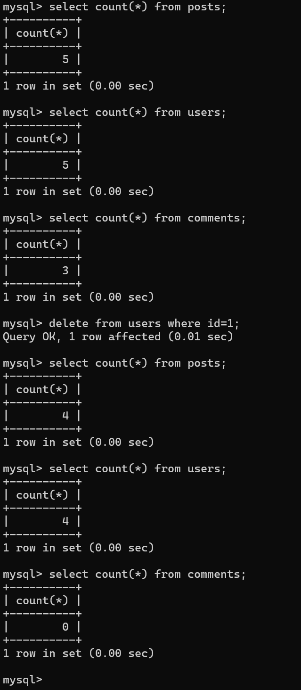

---

#### Задание 10. SQL-инъекция
Результат (все пользователи)
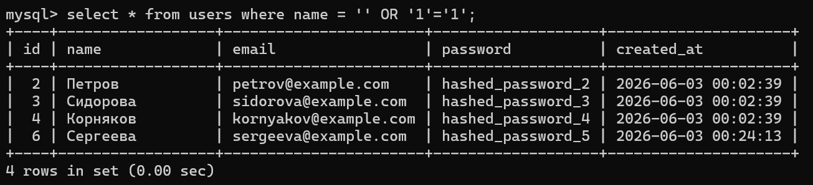

##### Как работает SQL-инъекция?
Данные объединяются с sql-запросом напрямую, следовательно, при вводе вместо логина часть sql запроса она будет исполнена.

##### Как prepared statement защищает?
Prepared Statement разделяет SQL-запрос на неизменяемый шаблон и передаваемые данные, отправляя их на сервер базы данных по отдельности.

---

### Часть D. PHP + MySQL

#### Задание 11. db.php
Содержимое db.php
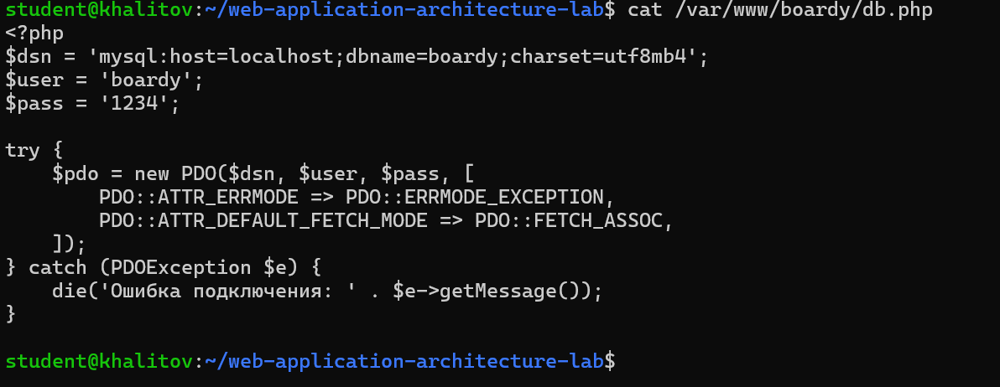

---

#### Задание 12. submit.php через MySQL
Отправка формы, «Спасибо»
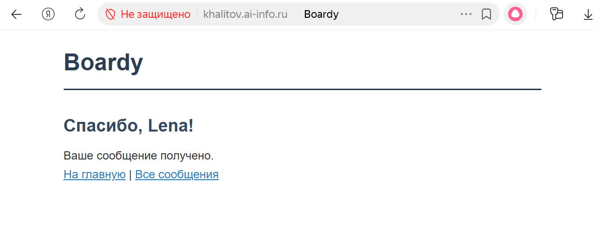

Новая запись в posts (phpMyAdmin → posts → Обзор)
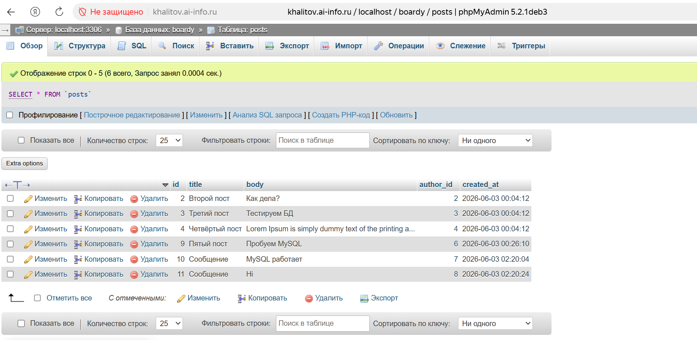

---

#### Задание 13. messages.php через MySQL
Страница с данными из MySQL
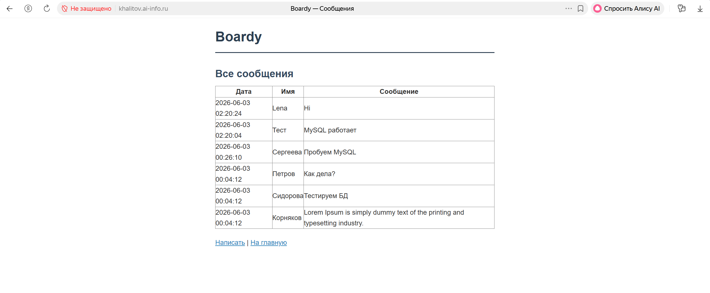

---

### Часть E. FastAPI + MySQL

#### Задание 14. aiomysql
Curl .../api/messages (JSON из MySQL)
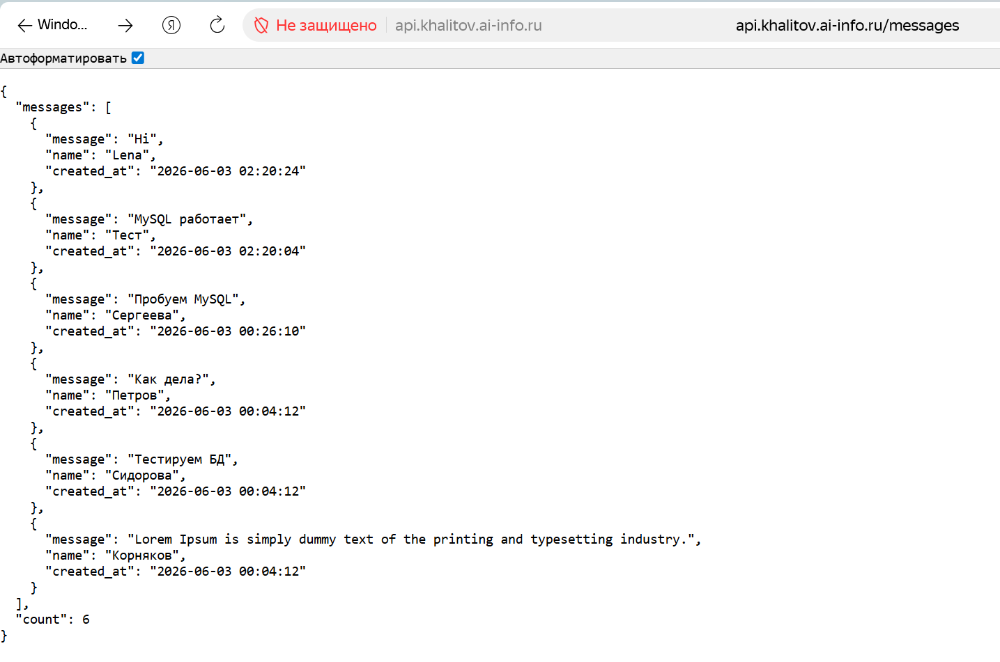

Curl .../api/users (JSON)
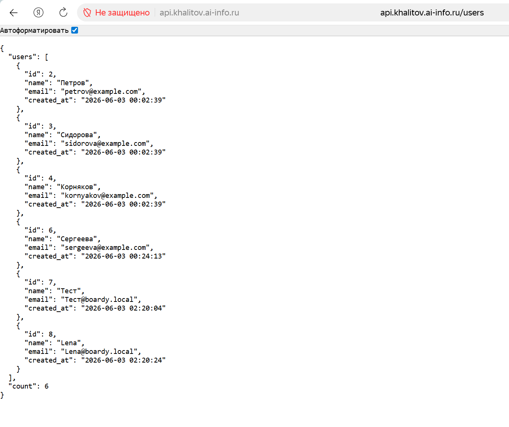

##### Почему aiomysql, а не обычный mysql-connector?
Aiomysql - это асинхронный драйвер, который не будет блокировать весь event loop.

##### Что будет с event loop при синхронном драйвере?
Будет происходить блокировка, как с командой time.sleep.

---

PR на GitHub
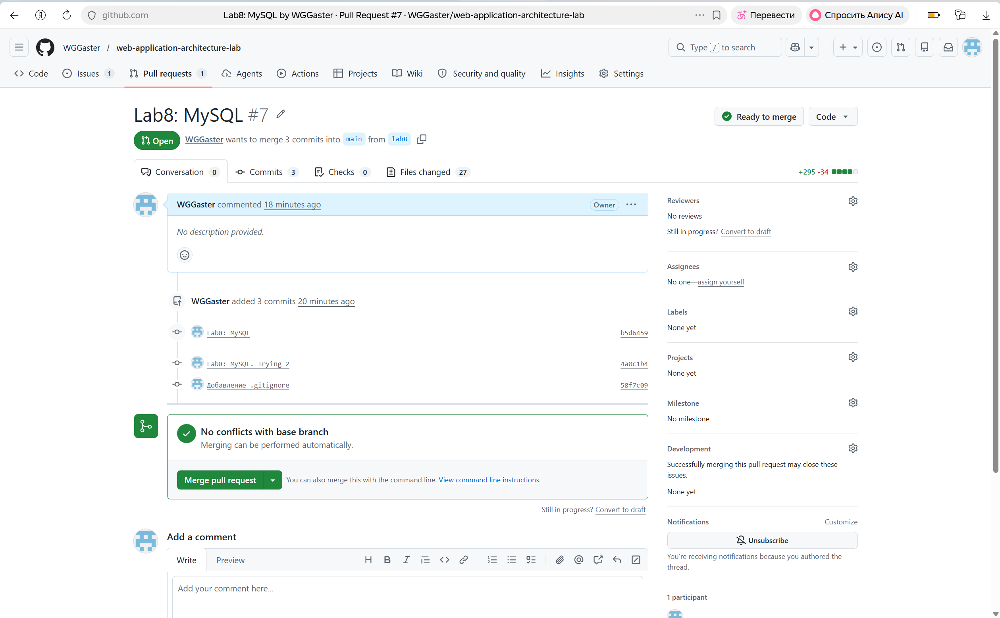

