# Отчет по лабораторной работе №9
**Тема:** REST API, SSR vs CSR, JavaScript, React

---

### Часть A. REST API

#### Задание 1. Структура проекта
Дерево файлов /opt/boardy-api/ (команда ls -R)
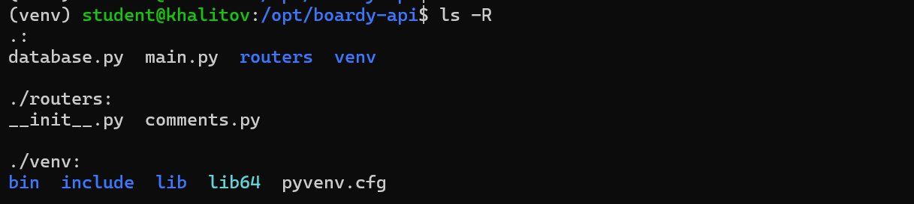

---

#### Задание 2. GET — список комментариев
JSON-массив с именами авторов (JOIN работает)
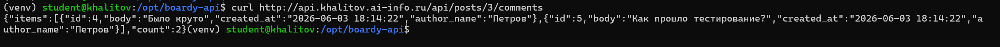

##### Какой SQL-запрос выполняет этот эндпоинт?
Получение комментариев под конкретным постом.

##### Зачем JOIN?
Для получения из другой таблицы имена авторов комментариев.

---

#### Задание 3. POST — создать комментарий
Ответ 201 Created
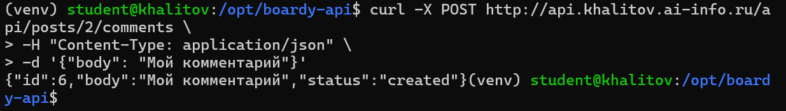

##### Почему 201, а не 200?
Код 201 указывает точное определение успеха, что мы создали новый комментарий

##### Что означает Content-Type: application/json?
Тип содержимого в ответе или запросе будет JSON.

---

#### Задание 4. PUT — редактировать
Скриншот выполнения запроса редактирования комментария
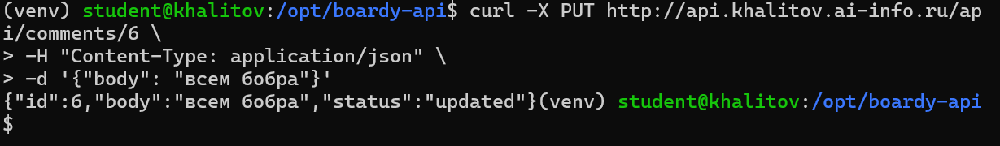

##### Чем PUT отличается от POST?
PUT обновляет данные, а POST добавляет новые.

##### Почему URL другой (/comments/{id}, а не /posts/{id}/comments)?
В рамках метода PUT нам нужно обновить конкретный комментарий, а не передавать одно и то же содержимое всем в рамках одного поста.

---

#### Задание 5. DELETE — удалить
Ответ 204
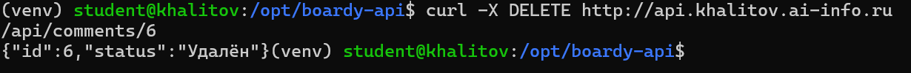

##### Перечислите 4 HTTP-глагола.
GET, POST, PUT, DELETE

##### Какой код ответа у каждого и почему?
GET и PUT возвращают 200. При получении или обновлении данных уникального статуса не существует, поэтому используется только 200. У PUT может ещё быть 204, но если обработанные данные не возвращаются. В текущем случае такого нет.
POST имеет статус 201. Можно использовать 200, но общепринято для более точного обозначения конкретного успеха использовать 201.
DELETE имеет статус 204. Причины те же, что и у POST.

---

#### Задание 6. Ошибки
Оба ответа (ошибки 404 и 422)
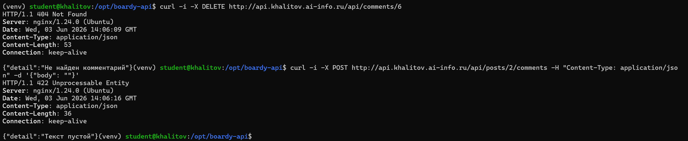

##### Чем 404 отличается от 422?
404 - данных не существует на сервере
422 - валидация данных не была пройдена (пустое значение или неправильный JSON-формат).

---

#### Задание 7. Swagger
Интерфейс документации Swagger с выполненным запросом
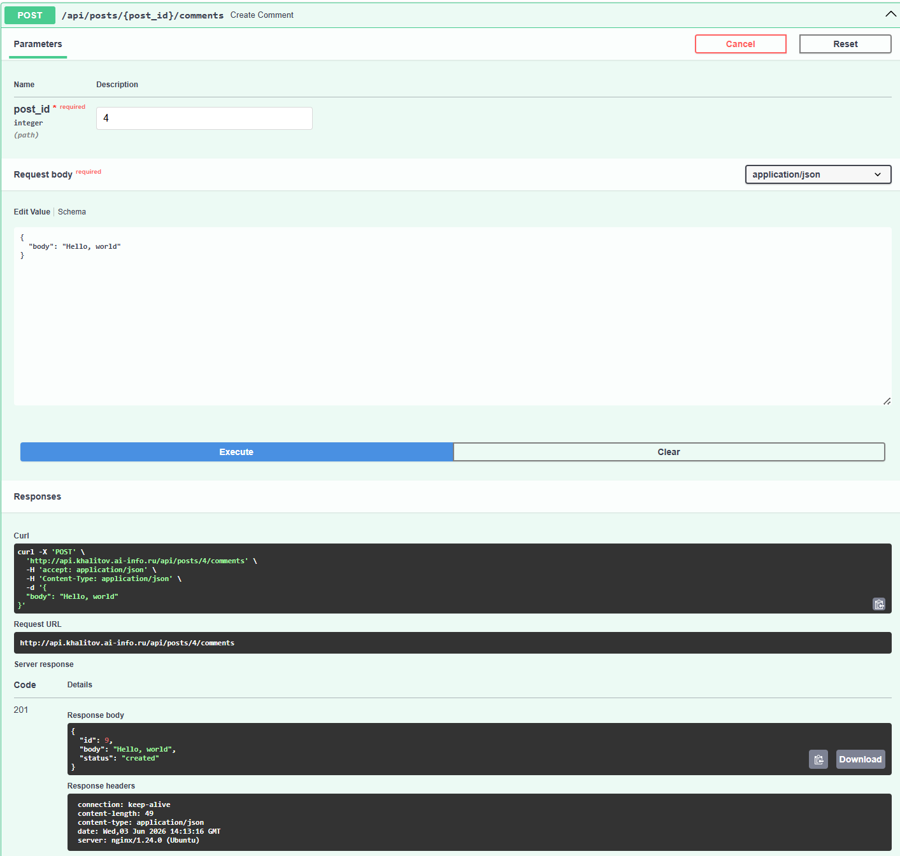

---

### Часть B. JavaScript-клиенты

#### Задание 8. Vanilla JS — демо
Список комментариев + создание нового
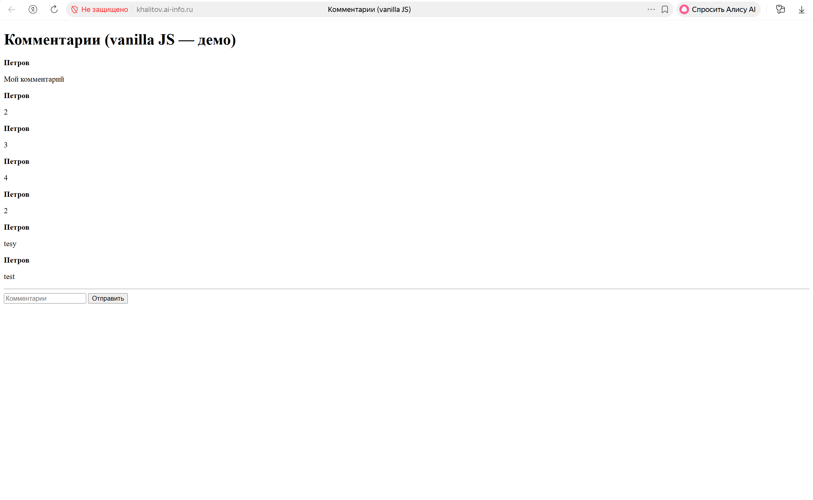

##### Что делает функция esc()?
Защищает от XSS.

##### Что случится если её не вызвать?
Любой пользователь сможет вставить произвольный <script>.

---

#### Задание 9. React — полный CRUD
Список комментариев (Bootstrap-карточки)
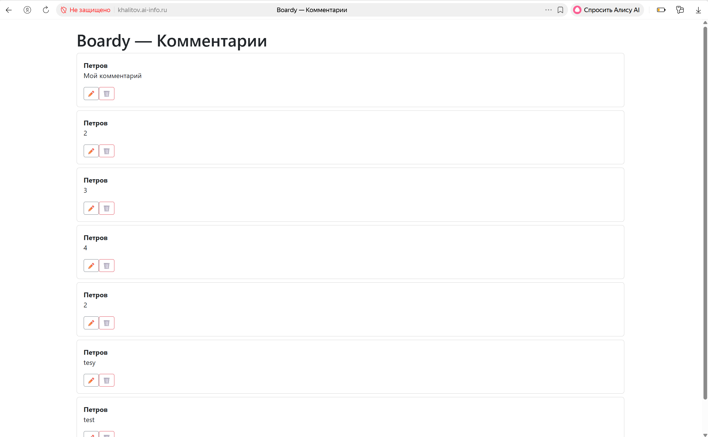

Режим редактирования (inline-форма)
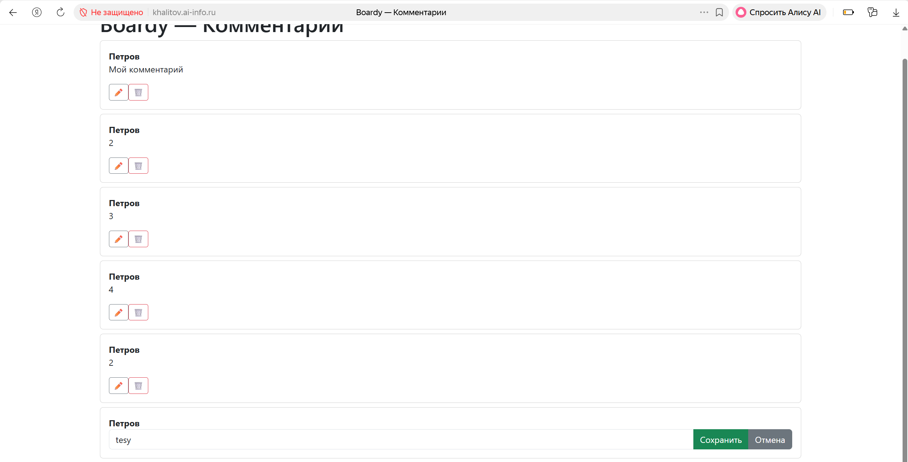

Удаление с подтверждением
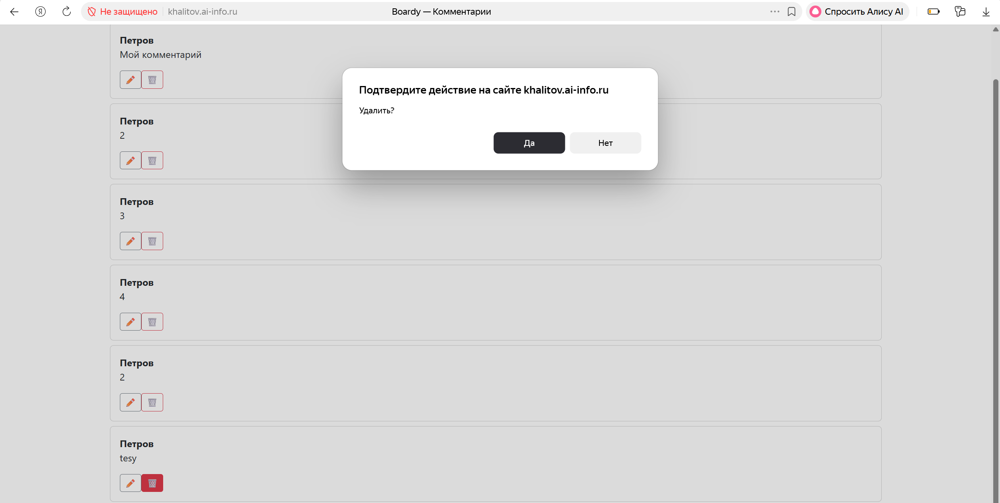

---

#### Задание 10. Сравнение кода
В отчёте: сравните vanilla JS и React по пунктам:
- Где хранится состояние (список комментариев, текст формы)?
Vanilla JS: в DOM-элементах.
React: в хуке useState

- Как обновляется список после добавления?
Vanilla JS: вручную через innerHTML
React: вызов setItems(), через который React автоматически перерендеривает компонент.

- Как реализовано редактирование?
Vanilla JS: сложно — нужно вручную показывать/скрывать формы и заменять DOM
React: просто — условный рендеринг {editId === item.id ? (<input />) : (
)}

- Как защищаемся от XSS?
Vanilla JS: вручную через textContent
React: экранирование символов происходит автоматически.

---

#### Задание 11. DevTools → Network
Список запросов в панели Network
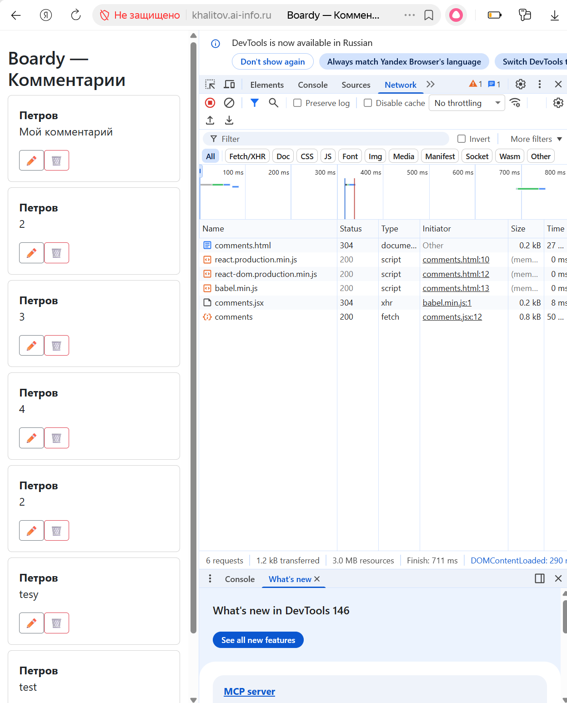

##### Сколько запросов?
6

##### Какой из них — к API?
Comments

---

### Часть C. SSR vs CSR

#### Задание 12. View Source
Исходный код страниц messages.php и comments.html
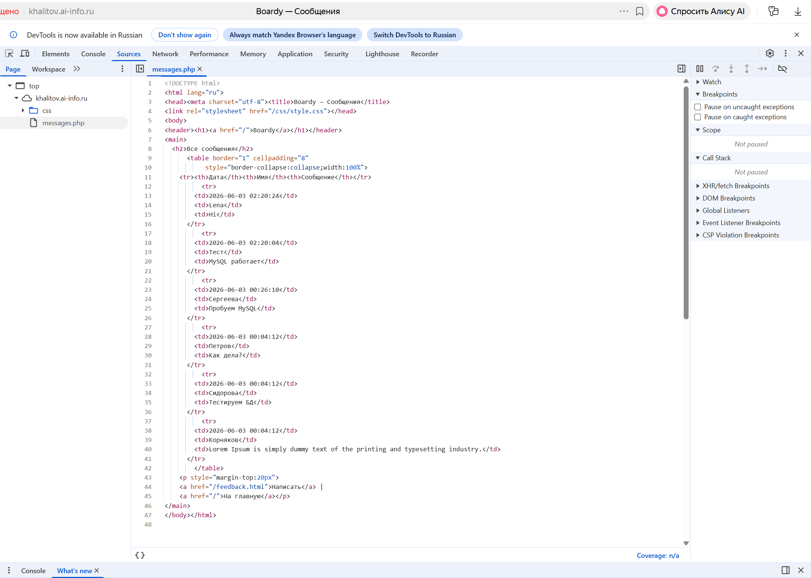
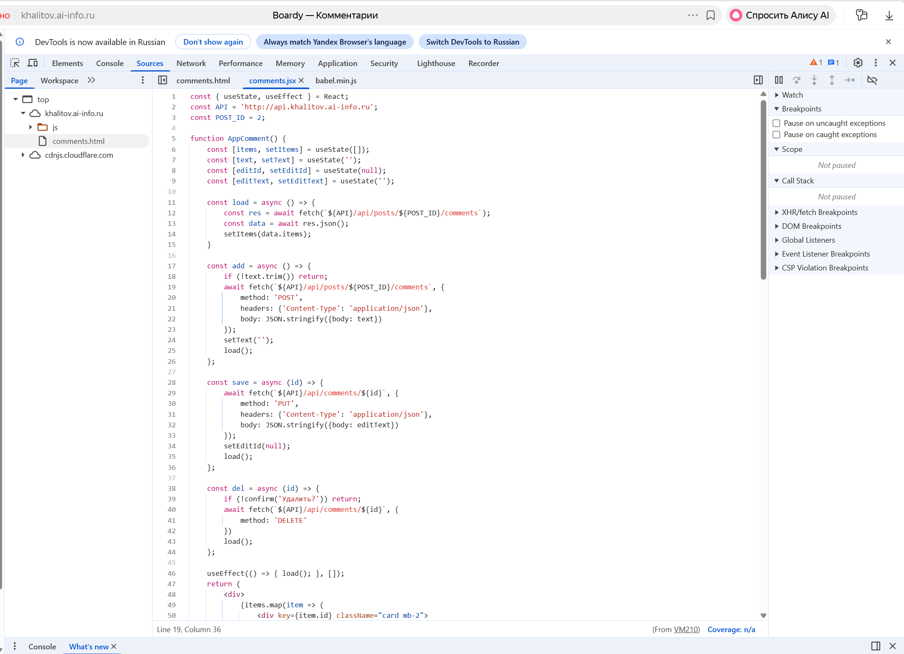

##### Почему в CSR нет данных в исходнике?
В CSR страница изначально пустая. При получении данных от сервера он лишь тогда начинает генерировать что-то генерировать.

##### Что увидит поисковый бот?
В SSR данные видны, поэтому бот их сможет прочитать
В СSR, как раннее говорилось, страница будет пустой, так что бот увидит ничего.

---

#### Задание 13. XSS
Текст, не alert

##### Как vanilla JS и React защищаются от XSS?
В vanilla JS используется div.textContent, но его придётся вручную проставлять в каждых местах вставки текста.
В React всё происходит автоматически, поэтому программисту задумываться об этом уже не нужно.

##### Какой способ надёжнее?
React.

---

#### Задание 14. Итоговая таблица
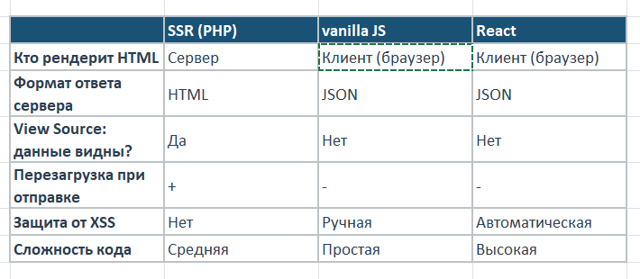

---

### Сдача через Pull Request
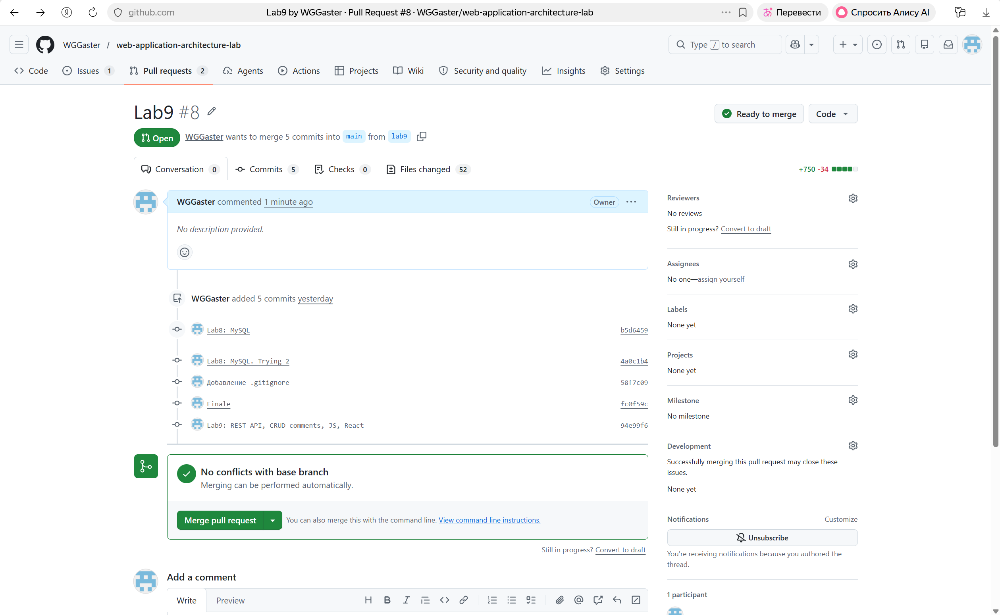
